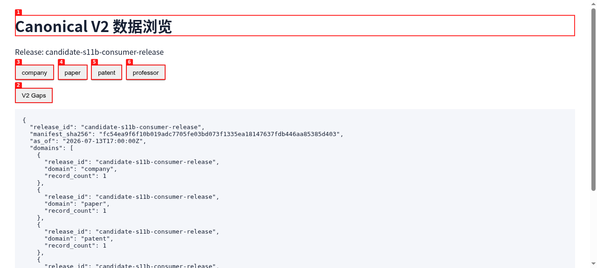
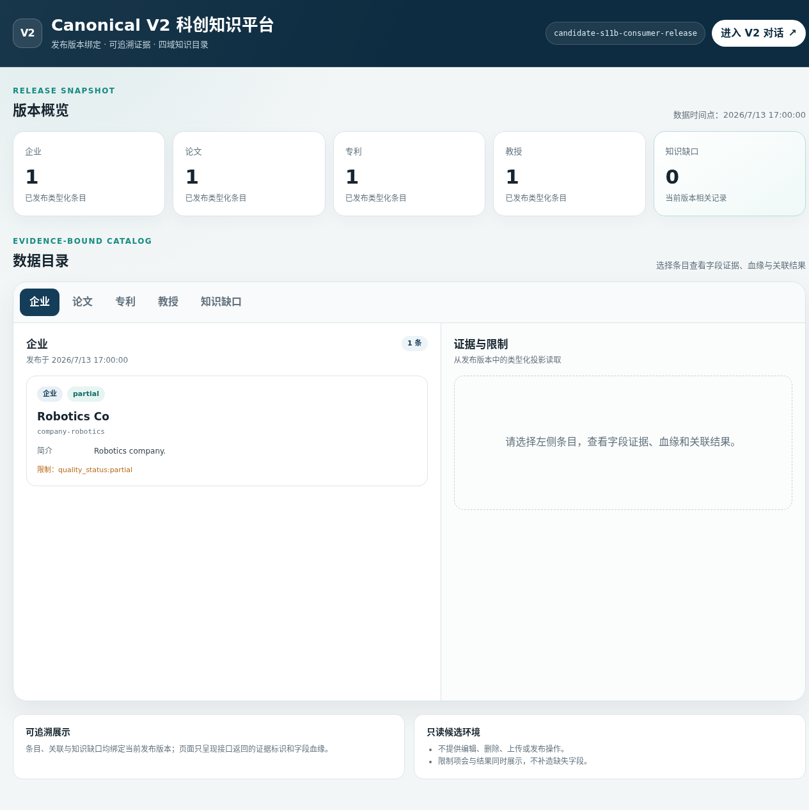
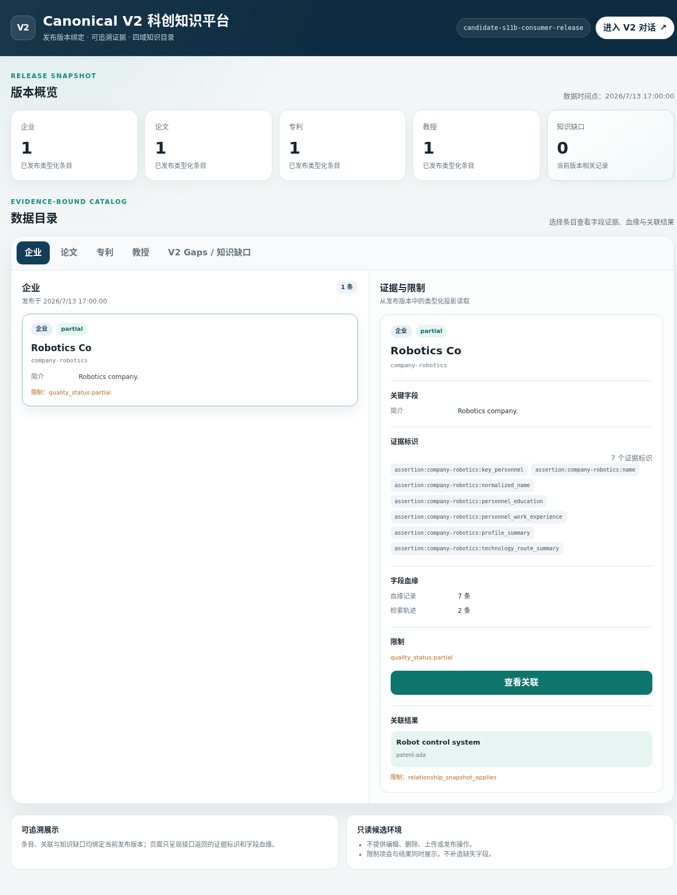
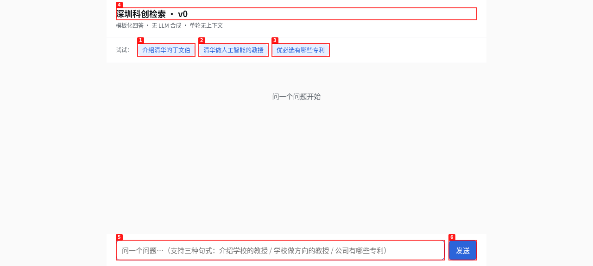
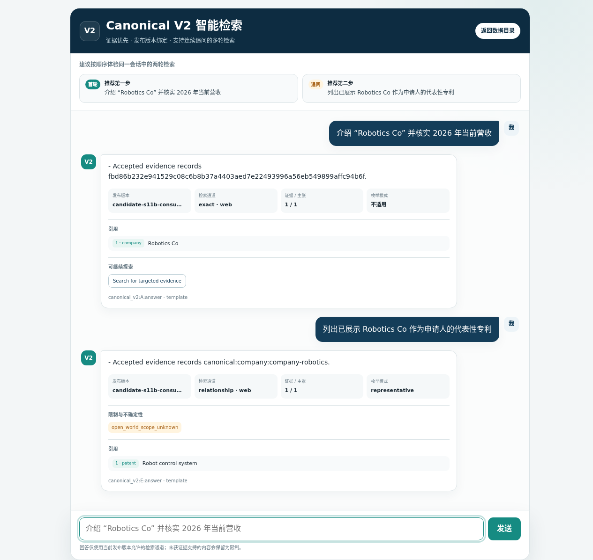

# Dogfood Report: Canonical V2 Disposable Candidate Preview

| Field | Value |
|---|---|
| **Date** | 2026-07-21 |
| **App URL** | http://127.0.0.1:18188 |
| **Session** | canonical-v2-preview |
| **Scope** | Client-demo readiness for `/browse`, `/chat`, and visible Canonical V2 fixture behavior |

## Summary

| Severity | Count |
|---|---:|
| Critical | 0 |
| High | 0 |
| Medium | 0 |
| Low | 0 |
| **Active total** | **0** |
| **Resolved during this run** | **3** |

## Issues

### ISSUE-001: 数据浏览页只展示原始 JSON，无法承担客户演示

| Field | Value |
|---|---|
| **Severity** | high |
| **Category** | functional / UX |
| **URL** | http://127.0.0.1:18188/browse |
| **Repro Video** | N/A |
| **Status** | Resolved |

**Description**

页面能够读取正确的 release/status，但所有状态和领域数据只呈现为长 JSON 文本；没有可读的领域卡片、详情、关联、证据或限制视图。

**Repro Steps**

1. 打开 `/browse`，即可看到原始 JSON 占据主体区域。
   

**Resolution evidence**

`/browse` 现提供响应式版本概览、四域目录、类型化详情、字段证据、限制和关系结果。
浏览器实测完成 `Robotics Co` 详情及 `Robot control system` 关联读取。

### ISSUE-002: 对话页仍使用 v0 品牌和旧数据示例

| Field | Value |
|---|---|
| **Severity** | medium |
| **Category** | content / UX |
| **URL** | http://127.0.0.1:18188/chat |
| **Repro Video** | N/A |
| **Status** | Resolved |

**Description**

页面标题为“深圳科创检索 · v0”，示例问题指向当前 fixture 中不存在的清华、优必选数据，点击后无法展示 Canonical V2 的有效多轮场景。

**Repro Steps**

1. 打开 `/chat`，观察标题、说明和三个旧示例。
   

**Resolution evidence**

`/chat` 现使用 Canonical V2 品牌和当前 fixture 的两轮示例。浏览器在同一 Cookie 会话中
完成两次 `POST /api/chat`，第二轮正确绑定首轮展示的 Company，并返回代表性 Patent、枚举
模式和开放世界限制。

### ISSUE-003: 浏览器请求不存在的 favicon

| Field | Value |
|---|---|
| **Severity** | low |
| **Category** | console / network |
| **URL** | http://127.0.0.1:18188/browse |
| **Repro Video** | N/A |
| **Status** | Resolved |

**Description**

首次打开页面会请求 `/favicon.ico` 并得到 404。它不阻塞演示，但会产生无关网络错误。

**Resolution evidence**

两个 V2 页面现使用内联 data-URI favicon；全新桌面和移动浏览器会话无该 404，控制台无
JavaScript 错误。

## Final demo verification

- Desktop `/browse`: status, four-domain navigation, detail, evidence/lineage, limitations, and
  related traversal passed.
- Desktop `/chat`: two fixture buttons produced two same-cookie requests and two grounded response
  cards; release, lanes, claim/evidence counts, representative coverage, limitations, and citations
  rendered.
- Mobile `390x844`: `/browse` and `/chat` remained readable and operable.
- Fresh-session browser console: no JavaScript errors.
- Preview data remains a disposable one-object-per-public-domain Candidate fixture, not a complete
  recovered production dataset.
