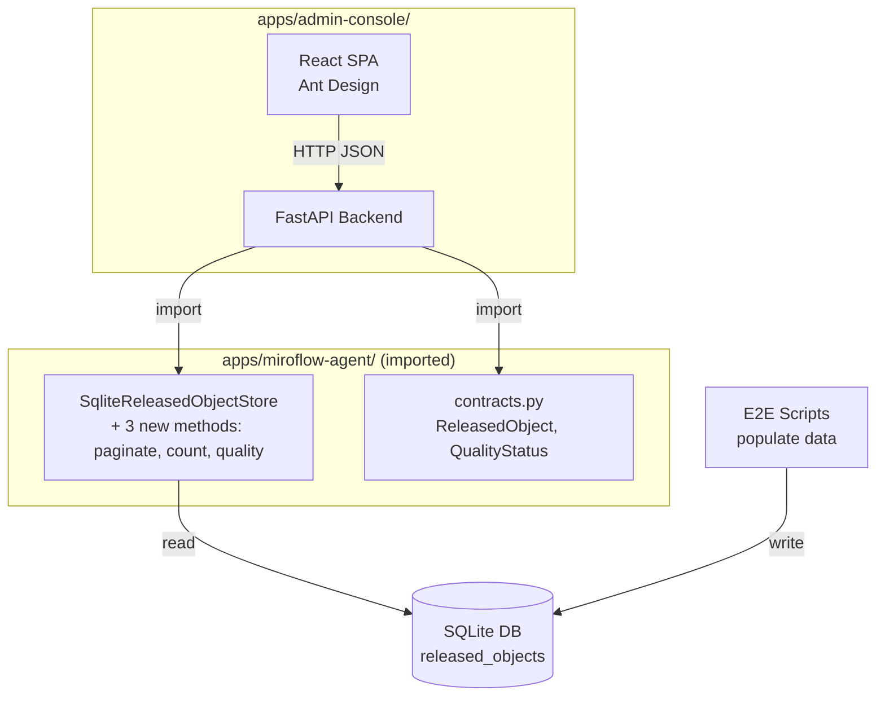

# feat: Web Admin Console for Sci-Tech Data Platform

## Overview

Build a read-only web admin console that lets the data operations team browse, search, and inspect the knowledge base across all four domains (professors, companies, papers, patents). The backend is a FastAPI REST API that reuses existing Pydantic contracts and SQLite store; the frontend is a React SPA with Ant Design. The API layer is designed for reuse by the future Agentic RAG chat agent.

## Problem Frame

The platform has a working data collection pipeline with 45+ Python modules, E2E scripts, and SQLite persistence. But there is no visual interface to browse the data. Non-technical stakeholders have zero access. Engineers must query SQLite with raw SQL. Data quality and completeness are invisible without running scripts. The admin console is the operator control plane that replaces all manual inspection workflows.

## Requirements Trace

- R1. Dashboard landing page shows per-domain record counts and quality status breakdown
- R2. Domain list views with display_name search, server-side pagination, and column sorting
- R3. Record detail view renders full Pydantic model with evidence sources
- R4. Backend reuses existing `contracts.py` models and `sqlite_store.py` — no data duplication
- R5. API endpoints are RESTful and reusable for future chat agent service layer
- R6. Chinese language UI (Shenzhen-based users)
- R7. Phase 1 is read-only — no editing, no auth, no WebSocket

## Scope Boundaries

- No authentication or authorization (internal-only access, Phase 2)
- No editing or curation workflows (Phase 2)
- No institution/quality_status column filters (requires JSON extraction or denormalization, Phase 2)
- No real-time pipeline status via WebSocket (Phase 2)
- No Milvus semantic search (SHA256 hash embeddings are broken)
- No cross-domain relation endpoints (related records, reverse lookups — Phase 2, when relation coverage is complete)

## Context & Research

### Relevant Code and Patterns

- `apps/miroflow-agent/src/data_agents/contracts.py` — `ReleasedObject` (4 columns: `id`, `object_type`, `display_name`, `payload_json`), `QualityStatus`, domain-specific records with `to_released_object()` converters
- `apps/miroflow-agent/src/data_agents/storage/sqlite_store.py` — `SqliteReleasedObjectStore` with `get_object()`, `search_domain()`, `list_domain_objects()`, `get_related_objects()`, `upsert_released_objects()`. Table schema: `released_objects(id TEXT PK, object_type TEXT, display_name TEXT, payload_json TEXT)` with index on `object_type`
- `apps/miroflow-agent/src/data_agents/service/search_service.py` — `DataSearchService` requires `MilvusVectorStore` in constructor — admin console bypasses this entirely
- `apps/miroflow-agent/tests/data_agents/` — 31 test files, factory-function pattern with Chinese test data, pytest markers (`unit`, `integration`)
- Root `pyproject.toml` — `[tool.uv.sources]` with editable workspace dependencies for all apps: `miroflow-agent = { path = "apps/miroflow-agent", editable = true }`
- `apps/miroflow-agent/conf/data_agent/default.yaml` — output_path is JSONL; SQLite DB path is passed at `SqliteReleasedObjectStore` construction time. Admin console configures this via `ADMIN_DB_PATH` env var (default: `logs/data_agents/released_objects.db`)

### Existing Store Gaps

The current `SqliteReleasedObjectStore` loads ALL rows via `_load_domain_objects()` then filters in Python. The admin console needs:
1. `list_domain_paginated()` — SQL-level `LIMIT/OFFSET` + `COUNT(*)` + `LIKE` filter + `ORDER BY`
2. `count_by_domain()` — `GROUP BY object_type` aggregate
3. `quality_breakdown(domain)` — Python-side counting via existing `_load_domain_objects()` (sufficient for current data volumes of hundreds of records; SQL-level `json_extract` optimization deferred until scale demands it)

### Cross-App Import

Root `pyproject.toml` already uses editable workspace deps. Admin console follows the same pattern: `miroflow-agent = { path = "../miroflow-agent", editable = true }` in its own `pyproject.toml`. Verified: miroflow-agent's `pyproject.toml` uses hatch build backend with `packages = ["src"]`, which exposes the `src` package as a top-level import — the `from src.data_agents.contracts import ...` import path will resolve correctly from sibling apps.

## Key Technical Decisions

- **FastAPI + React with Ant Design** over HTMX or Streamlit: API layer becomes reusable backbone for the chat agent. Ant Design provides production-quality Chinese table components. (see origin)
- **SQLite-only, bypass DataSearchService**: Avoids MilvusVectorStore dependency entirely. Admin console imports `SqliteReleasedObjectStore` directly.
- **Store enhancements in existing file**: New methods added to `sqlite_store.py` — no new storage module. Preserves single source of truth.
- **Python-side quality aggregation**: For current data volumes (hundreds of records), loading domain objects and counting `quality_status` in Python is simpler and sufficient. Avoids `json_extract` dependency and fallback complexity. Optimize to SQL-level aggregation only when data grows to thousands.
- **Domain-generic API routes**: Single `GET /api/{domain}` endpoint with domain validated against `ObjectType` literal, rather than four separate router files. Reduces boilerplate while keeping type safety.

## Open Questions

### Resolved During Planning

- **Where does the SQLite DB live?**: Configured via environment variable `ADMIN_DB_PATH` with default `logs/data_agents/released_objects.db`. The E2E scripts and admin console point to the same file.
- **How to import miroflow-agent modules?**: Use `[tool.uv.sources]` editable workspace dependency (proven pattern in root pyproject.toml).
- **Four router files vs generic route?**: Generic `GET /api/{domain}` with path validation — the four domains have identical API surface through `ReleasedObject`.

### Deferred to Implementation

- Exact column definitions for Ant Design domain tables (varies per domain's `core_facts` keys — resolve when building `DomainTable.tsx`)
- Frontend build output directory for FastAPI static file serving (resolve when setting up the React project)

## High-Level Technical Design

> *This illustrates the intended approach and is directional guidance for review, not implementation specification. The implementing agent should treat it as context, not code to reproduce.*



**API route pattern:**
```
/api/dashboard       → count_by_domain() + quality_breakdown() per domain
/api/{domain}        → list_domain_paginated(query, offset, limit, sort_by, sort_order)
/api/{domain}/{id}   → get_object(domain, id)
```

## Implementation Units

### Phase A: Store Enhancements (prerequisite)

- [x] **Unit 1: Add pagination, count, and quality breakdown methods to SqliteReleasedObjectStore**

**Goal:** Enable SQL-level pagination, domain counting, and quality aggregation without loading all rows into memory.

**Requirements:** R1, R2, R4

**Dependencies:** None

**Files:**
- Modify: `apps/miroflow-agent/src/data_agents/storage/sqlite_store.py`
- Create: `apps/miroflow-agent/tests/data_agents/storage/test_sqlite_store.py`

**Approach:**
- Add `list_domain_paginated(domain, *, query="", offset=0, limit=20, sort_by="display_name", sort_order="asc") -> tuple[list[ReleasedObject], int]` using SQL `WHERE object_type = ? AND display_name LIKE ?` with `ORDER BY {validated_column} {validated_order} LIMIT ? OFFSET ?` and a `SELECT COUNT(*)` for total. Whitelist sortable columns to `("id", "display_name")` to prevent SQL injection.
- Add `count_by_domain() -> dict[str, int]` using `SELECT object_type, COUNT(*) FROM released_objects GROUP BY object_type`
- Add `quality_breakdown(domain) -> dict[str, int]` using Python-side counting: call `_load_domain_objects(domain)` and count `quality_status` values with `collections.Counter`. Simple and correct for current data volumes.

**Execution note:** Start with failing tests for each new method, then implement to make them pass.

**Patterns to follow:**
- Existing `get_object()` and `_load_domain_objects()` use `sqlite3.connect(self.db_path)` context manager pattern
- Existing tests in `tests/data_agents/test_contracts.py` use factory functions with `TIMESTAMP` constant and Chinese test data

**Test scenarios:**
- Happy path: `list_domain_paginated("professor")` returns first page of professors sorted by display_name asc, total count matches inserted count
- Happy path: `list_domain_paginated("professor", query="靳")` filters to professors with "靳" in display_name, total reflects filtered count
- Happy path: `list_domain_paginated("professor", offset=20, limit=10)` returns correct page with correct total
- Edge case: `list_domain_paginated("professor")` on empty DB returns `([], 0)`
- Edge case: `list_domain_paginated("professor", sort_by="id", sort_order="desc")` reverses order
- Edge case: Invalid `sort_by` value (e.g., `"payload_json"`) raises `ValueError` — whitelist enforced before SQL construction
- Happy path: `count_by_domain()` with 3 professors and 2 companies returns `{"professor": 3, "company": 2}`
- Edge case: `count_by_domain()` on empty DB returns `{}`
- Happy path: `quality_breakdown("professor")` with mixed statuses returns `{"ready": 2, "needs_review": 1}`
- Edge case: `quality_breakdown("nonexistent")` returns `{}`

**Verification:**
- All new methods have passing unit tests
- Existing `search_domain`, `get_object`, `upsert_released_objects` tests still pass (no regression)

---

### Phase B: FastAPI Backend

- [x] **Unit 2: Scaffold admin-console app with FastAPI + uv workspace**

**Goal:** Create the `apps/admin-console/` directory structure with a runnable FastAPI app that imports from miroflow-agent.

**Requirements:** R4, R5

**Dependencies:** Unit 1

**Files:**
- Create: `apps/admin-console/pyproject.toml`
- Create: `apps/admin-console/backend/__init__.py`
- Create: `apps/admin-console/backend/main.py`
- Create: `apps/admin-console/backend/deps.py`
- Modify: `pyproject.toml` (root — add admin-console to uv.sources)

**Approach:**
- `pyproject.toml`: declare `fastapi[standard]`, `uvicorn`, and `miroflow-agent` as editable workspace dep
- `main.py`: FastAPI app with CORS middleware (allow all origins for dev), lifespan that initializes `SqliteReleasedObjectStore` from `ADMIN_DB_PATH` env var
- `deps.py`: FastAPI dependency that provides the store instance
- Add `admin-console = { path = "apps/admin-console", editable = true }` to root `pyproject.toml` sources
- Verify the import: `from src.data_agents.contracts import ReleasedObject` works from admin-console context

**Execution note:** Execution target: external-delegate

**Patterns to follow:**
- Root `pyproject.toml` `[tool.uv.sources]` pattern for workspace deps
- `apps/miroflow-agent/pyproject.toml` for `[tool.uv.sources]` editable path format

**Test scenarios:**
- Happy path: `uv sync` in repo root installs admin-console and its dependency on miroflow-agent
- Happy path: `from src.data_agents.contracts import ReleasedObject` succeeds in admin-console context
- Happy path: FastAPI app starts and responds to `GET /` with health check

**Verification:**
- `uv run --package admin-console python -c "from src.data_agents.contracts import ReleasedObject; print('OK')"` succeeds
- `uv run --package admin-console uvicorn backend.main:app --port 8100` starts without error

---

- [x] **Unit 3: Implement dashboard API endpoint**

**Goal:** Serve per-domain counts and quality breakdown at `GET /api/dashboard`.

**Requirements:** R1, R5

**Dependencies:** Unit 1, Unit 2

**Files:**
- Create: `apps/admin-console/backend/api/__init__.py`
- Create: `apps/admin-console/backend/api/dashboard.py`
- Create: `apps/admin-console/tests/test_dashboard.py`

**Approach:**
- Pydantic response model: `DashboardResponse` with `domains: list[DomainStats]` where `DomainStats` has `name`, `count`, `quality: dict[str, int]`
- Route calls `store.count_by_domain()` for counts and `store.quality_breakdown(domain)` for each domain
- Use FastAPI's `TestClient` for test

**Patterns to follow:**
- FastAPI router pattern with `APIRouter(prefix="/api")`
- Pydantic response model validation

**Test scenarios:**
- Happy path: Dashboard with populated DB returns correct counts for all 4 domains and quality breakdown per domain
- Edge case: Dashboard with empty DB returns empty domains list or domains with zero counts
- Happy path: Response matches Pydantic `DashboardResponse` schema

**Verification:**
- `GET /api/dashboard` returns valid JSON matching the response schema
- Counts match what was inserted via `upsert_released_objects`

---

- [x] **Unit 4: Implement domain list and detail API endpoints**

**Goal:** Serve paginated domain listings and individual record details.

**Requirements:** R2, R3, R5

**Dependencies:** Unit 1, Unit 2

**Files:**
- Create: `apps/admin-console/backend/api/domains.py`
- Create: `apps/admin-console/tests/test_domains.py`

**Approach:**
- `GET /api/{domain}` — validate `domain` against `ObjectType` literal. Query params: `q`, `page` (1-based), `page_size` (default 20, max 100), `sort_by`, `sort_order`. Convert page/page_size to offset/limit for store call. Response: `{ items: [...], total, page, page_size }`
- `GET /api/{domain}/{id}` — call `store.get_object(domain, id)`. Return full `ReleasedObject` JSON. 404 if not found.
- Invalid domain returns 422 via FastAPI's path validation
- Note: Cross-domain relation endpoints deferred to Phase 2 (only 3 of 5 relation types implemented in store; loading all target-domain rows for relation matching is a performance concern)

**Patterns to follow:**
- `ReleasedObject.model_dump(mode="json")` for serialization (consistent with existing codebase)

**Test scenarios:**
- Happy path: `GET /api/professor?page=1&page_size=10` returns paginated list with correct total
- Happy path: `GET /api/professor?q=靳` filters results by display_name
- Happy path: `GET /api/professor?sort_by=display_name&sort_order=desc` returns reverse-sorted results
- Edge case: `GET /api/professor?page=999` returns empty items with correct total
- Edge case: `GET /api/invalid_domain` returns 422
- Happy path: `GET /api/professor/PROF-1` returns full record detail
- Edge case: `GET /api/professor/NONEXISTENT` returns 404

**Verification:**
- All 4 domain types work with list and detail endpoints
- Pagination math is correct (page 2 with page_size 10 → offset 10)
- Error responses follow `{ "detail": "..." }` format

---

### Phase C: React Frontend

- [x] **Unit 5: Scaffold React app with Ant Design and routing**

**Goal:** Create the frontend SPA skeleton with navigation sidebar and React Router.

**Requirements:** R6

**Dependencies:** Unit 2

**Files:**
- Create: `apps/admin-console/frontend/package.json`
- Create: `apps/admin-console/frontend/src/App.tsx`
- Create: `apps/admin-console/frontend/src/main.tsx`
- Create: `apps/admin-console/frontend/src/api.ts`
- Create: `apps/admin-console/frontend/vite.config.ts`
- Create: `apps/admin-console/frontend/tsconfig.json`

**Approach:**
- Vite + React + TypeScript scaffold
- Ant Design with Chinese locale (`zh_CN`)
- `App.tsx`: Ant `Layout` with `Sider` navigation (数据总览, 教授, 企业, 论文, 专利) and `Content` area with React Router `Outlet`
- `api.ts`: typed fetch wrapper for all API endpoints, base URL from env or `/api` proxy
- Vite dev server proxy `/api` to `http://localhost:8100`

**Execution note:** Execution target: external-delegate

**Test expectation: none** — scaffolding only, visual verification

**Verification:**
- `npm install && npm run dev` starts without errors
- Browser shows sidebar navigation with Chinese labels
- Clicking nav items changes route

---

- [x] **Unit 6: Dashboard page with stat cards and quality overview**

**Goal:** Build the landing page showing domain coverage and quality breakdown.

**Requirements:** R1, R6

**Dependencies:** Unit 3, Unit 5

**Files:**
- Create: `apps/admin-console/frontend/src/pages/Dashboard.tsx`
- Create: `apps/admin-console/frontend/src/components/StatCard.tsx`
- Create: `apps/admin-console/frontend/src/components/QualityTag.tsx`

**Approach:**
- Fetch `GET /api/dashboard` on mount
- Render 4 `StatCard` components (one per domain) using Ant `Statistic` component: domain icon, Chinese label, count
- Below cards: Ant `Table` showing quality breakdown per domain (columns: 域, ready, needs_review, low_confidence)
- `QualityTag`: Ant `Tag` component with color-coded labels (ready=green, needs_review=orange, low_confidence=red)

**Execution note:** Execution target: external-delegate

**Test expectation: none** — visual verification against running backend with populated data

**Verification:**
- Dashboard loads and shows 4 stat cards with real numbers from SQLite
- Quality overview table shows breakdown per domain
- Loading state shown while fetching

---

- [x] **Unit 7: Domain list page with search and pagination**

**Goal:** Build the table view for browsing records in any domain.

**Requirements:** R2, R6

**Dependencies:** Unit 4, Unit 5

**Files:**
- Create: `apps/admin-console/frontend/src/pages/DomainList.tsx`
- Create: `apps/admin-console/frontend/src/components/DomainTable.tsx`

**Approach:**
- Single `DomainList.tsx` page component used for all 4 domain routes (parameterized by `:domain`)
- `DomainTable.tsx`: Ant `Table` with server-side pagination (`onChange` triggers re-fetch with new page), search input (`Input.Search`) for display_name filter, sortable columns via Ant Table `sorter` prop
- Domain-specific columns: render key `core_facts` fields based on domain type (professor: name, institution, department, title; company: name, industry; paper: title, year, venue; patent: title, patent_type, applicants)
- Row click navigates to detail page
- URL search params preserve page/query state for browser back

**Execution note:** Execution target: external-delegate

**Test expectation: none** — visual verification

**Verification:**
- Table loads with paginated data from API
- Search input filters by display_name
- Clicking column header triggers server-side sort
- Pagination controls work (next/prev page)
- Clicking a row navigates to detail page

---

- [x] **Unit 8: Record detail page with evidence sources**

**Goal:** Build the detail view for a single record showing all fields and evidence provenance.

**Requirements:** R3, R6

**Dependencies:** Unit 4, Unit 5

**Files:**
- Create: `apps/admin-console/frontend/src/pages/RecordDetail.tsx`
- Create: `apps/admin-console/frontend/src/components/EvidenceList.tsx`

**Approach:**
- Fetch `GET /api/{domain}/{id}` on mount
- Render `core_facts` as Ant `Descriptions` component (key-value pairs, Chinese labels)
- Render `summary_fields` as expandable text blocks
- `EvidenceList.tsx`: Ant `Timeline` showing each evidence source with type tag, URL link, timestamp, snippet
- Raw JSON toggle (Ant `Collapse` panel) for debugging
- Note: Related-records tab deferred to Phase 2 (cross-domain relation endpoint not in Phase 1)

**Execution note:** Execution target: external-delegate

**Test expectation: none** — visual verification

**Verification:**
- Detail page renders all core_facts and summary_fields for any domain record
- Evidence timeline shows sources with clickable URLs
- Raw JSON panel toggles correctly

## System-Wide Impact

- **Interaction graph:** Admin console reads from the same SQLite DB that E2E scripts write to. No write operations from the console — no conflict risk.
- **Error propagation:** FastAPI returns standard HTTP error codes. Frontend shows Ant `Result` error component for 404/500. No retry logic needed (read-only).
- **State lifecycle risks:** None — read-only access, no cache, no partial writes.
- **Unchanged invariants:** All existing data agent modules, E2E scripts, test suites, and pipeline are unmodified except for the 3 new store methods in `sqlite_store.py`. The new methods do not change existing method signatures.

## Risks & Dependencies

| Risk | Mitigation |
|------|------------|
| Cross-app import fails due to package resolution | Proven pattern in root pyproject.toml. Hatch build config `packages = ["src"]` verified. Fallback: symlink or extract to libs/. |
| No data in SQLite DB for demo | Run E2E scripts first. Add a `scripts/seed_demo_data.py` if E2E scripts require API keys. |
| Frontend Node.js dependency in Python monorepo | Isolated in `apps/admin-console/frontend/`, does not affect Python tooling. Add `node_modules/` to .gitignore. |

## Sources & References

- **Origin document:** [Design doc](~/.gstack/projects/BenjaminXiang-MiroThinker/longxiang-main-design-20260404-173718.md)
- Related code: `apps/miroflow-agent/src/data_agents/storage/sqlite_store.py`, `apps/miroflow-agent/src/data_agents/contracts.py`
- Related tests: `apps/miroflow-agent/tests/data_agents/test_contracts.py`, `apps/miroflow-agent/tests/data_agents/service/test_search_service.py`
