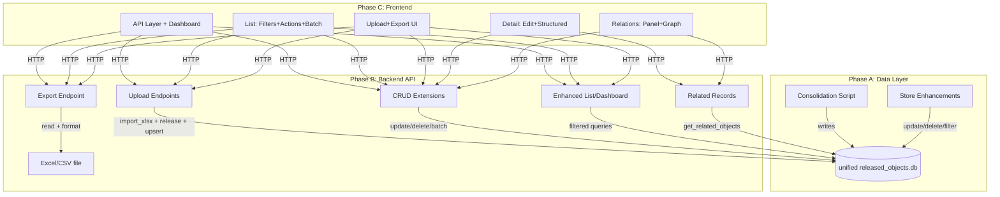

# feat: Admin Console Phase 2 — Full Data Management Upgrade

## Overview

Upgrade the admin console from a read-only data browser to a full data management platform. This includes: consolidating all 4 domain data into a unified SQLite DB, adding Excel upload for company/patent, field-level filtering and multi-field search, inline record editing via modal, batch operations (quality status / delete / export selected), data export (Excel + CSV), cross-domain relationship visualization with G6 graphs, and structured detail page display.

## Problem Frame

The Phase 1 admin console (completed 2026-04-04) provides read-only browsing. Three critical gaps remain:

1. **Data is invisible** — the default DB path points to a non-existent file; professor data is in a separate SQLite, company/paper/patent only exist as jsonl files. The admin console shows zero records.
2. **No data ingestion** — company and patent data arrive as Excel exports from external platforms (企名片, patent databases). Currently they can only be imported via CLI scripts. Non-technical operators need a web upload interface.
3. **No data management** — no editing, no quality workflow, no batch operations, no export, no cross-domain navigation. Operators must use raw SQL for any data task beyond browsing.

## Requirements Trace

- R1. All 4 domain data visible in admin console (professor 3274, company 1025, paper 4069, patent 1930)
- R2. Excel upload for company and patent domains — parse, release, upsert; duplicates updated (newer wins)
- R3. Multi-field search across name, research directions, summaries, and other text fields
- R4. Field-level filters per domain: professor(institution/title/quality), company(industry/quality), paper(year/venue/quality), patent(type/applicants/quality)
- R5. Row action buttons: view, edit, delete
- R6. Batch operations: multi-select → batch change quality_status / batch delete / export selected
- R7. Data export: full domain or selected records, Excel + CSV formats
- R8. Dashboard: per-domain last_updated timestamp in stat cards
- R9. Detail page: structured display (education table, research direction tags, awards list), each in a Card
- R10. Modal edit: edit core_facts + summary_fields + quality_status in a Modal dialog
- R11. Related records panel: professor→papers/patents, company→patents, with clickable navigation
- R12. Relationship graph: @ant-design/charts G6 visualization of entity connections

## Scope Boundaries

- No authentication or authorization (remains internal-only)
- No real-time pipeline status or WebSocket
- No Milvus semantic search integration (admin console uses SQLite only)
- No LLM-powered enrichment from the admin console (enrichment stays in pipeline scripts)
- Paper domain has no Excel upload (papers come from academic API pipelines)
- Professor domain has no Excel upload (professors come from web crawling pipeline)

## Context & Research

### Relevant Code and Patterns

- `apps/miroflow-agent/src/data_agents/storage/sqlite_store.py` — store with `upsert_released_objects`, `list_domain_paginated`, `search_domain`, `get_related_objects`. Schema: `released_objects(id TEXT PK, object_type TEXT, display_name TEXT, payload_json TEXT)`. WAL mode enabled.
- `apps/miroflow-agent/src/data_agents/company/import_xlsx.py` — header alias detection, row parsing, dedup merge, `CompanyImportResult`
- `apps/miroflow-agent/src/data_agents/patent/import_xlsx.py` — same pattern, `PatentImportResult`
- `apps/miroflow-agent/src/data_agents/company/release.py` — `build_company_release(records, source_file)` → `CompanyReleaseResult` with `released_objects`
- `apps/miroflow-agent/src/data_agents/patent/release.py` — `build_patent_release(records, source_file, company_name_to_id)` → `PatentReleaseResult`
- `apps/admin-console/tests/conftest.py` — `store(tmp_path)`, `populated_store`, `client` fixture chain with DI override
- `apps/admin-console/frontend/src/api.ts` — `fetchJSON<T>` GET-only wrapper, typed interfaces

### Institutional Learnings

- **LIKE escaping** (from `admin-console-fastapi-sqlite-patterns`): User input with `%`/`_` must be escaped with `ESCAPE '\\'`. Already implemented in `list_domain_paginated`.
- **Route collision** (same source): `/{domain}` catches all paths. New routes (`/upload`, `/export`, `/batch`) must use routers registered before the domain catch-all or use explicit prefixes.
- **WAL mode** (same source): Already enabled in `_initialize()`. Critical for concurrent upload + read.
- **openpyxl warnings** (from `data-agent-real-e2e-gates`): Suppress `UserWarning` about workbook styles at the `load_workbook()` call site. Both existing importers already do this.
- **Python-side filtering** (from `admin-console-fastapi-sqlite-patterns`): For datasets under a few thousand per domain, Python-side filtering is simpler than `json_extract`. Current volumes: ~10K total.
- **XSS in error messages** (same source): Never echo user-provided values in error responses.

## Key Technical Decisions

- **Field filtering via Python-side post-filter**: Load paginated results from SQL, then filter by core_facts fields in Python. For ~10K total records, this is fast and avoids `json_extract` dependency. Trade-off: pagination counts may be slightly off when heavy filtering reduces results. Mitigation: use `search_domain`-style full scan for filtered queries, SQL pagination for unfiltered.
- **Multi-field search via payload_json LIKE**: Extend `list_domain_paginated` to search against `payload_json` column (contains all fields as JSON text) instead of just `display_name`. This captures name, research directions, summaries, institution, etc. without JSON parsing.
- **Upload endpoint reuses existing import+release pipeline**: No new parsing logic. The endpoint writes the uploaded file to a temp path, calls `import_{company,patent}_xlsx()` → `build_{company,patent}_release()` → `store.upsert_released_objects()`. Upsert handles duplicates (newer wins) by design.
- **Route ordering for collision avoidance**: Register upload, export, batch routers with explicit `/api/upload/...`, `/api/export/...`, `/api/batch/...` prefixes before the domain router. The domain router keeps its `/{domain}` pattern.
- **@ant-design/charts for G6 graph**: Stays within the Ant Design ecosystem. Only used on the detail page relationship panel — not a heavy dependency.
- **Store update via full payload replacement**: `update_object(id, updated_released_object)` replaces the entire `payload_json`. The frontend reads the current object, modifies fields in the edit modal, and sends the complete updated object back. Simpler than field-level patching.

## Open Questions

### Resolved During Planning

- **How to handle field-level filtering with JSON payload?**: Python-side filtering for filtered queries; SQL pagination for unfiltered. The existing `_matches_filters` helper in `search_domain` provides the pattern.
- **Where to register new routes to avoid collision?**: Separate routers with explicit prefixes (`/api/upload`, `/api/export`, `/api/batch`) registered before the domain catch-all router.
- **How to handle Excel upload file storage?**: Temp file via `tempfile.NamedTemporaryFile`, deleted after processing. No persistent file storage.
- **Patent release needs `company_name_to_id` for linkage**: Build index from existing company records in the store at upload time. If no companies exist yet, linkage produces empty lists (graceful degradation).

### Deferred to Implementation

- Exact G6 graph layout algorithm and node styling (resolve when building the component)
- Whether to add `last_updated` as an indexed column or extract from payload_json (resolve based on query performance)
- Exact field list for each domain's edit modal form (resolve from `core_facts` key inspection)

## High-Level Technical Design

> *This illustrates the intended approach and is directional guidance for review, not implementation specification. The implementing agent should treat it as context, not code to reproduce.*



**API route structure (after upgrade):**

```
GET    /api/health
GET    /api/dashboard                  → counts + quality + last_updated
POST   /api/upload/{domain}            → Excel upload (company, patent only)
GET    /api/export/{domain}            → Export as Excel or CSV
PATCH  /api/batch/quality              → Batch update quality_status
DELETE /api/batch/delete               → Batch delete by IDs
GET    /api/{domain}                   → Paginated list + filters + multi-field search
GET    /api/{domain}/{id}              → Record detail
PATCH  /api/{domain}/{id}              → Update record (full payload replacement)
DELETE /api/{domain}/{id}              → Delete single record
GET    /api/{domain}/{id}/related      → Related records across domains
```

## Implementation Units

### Phase A: Data Layer

- [ ] **Unit 1: Data consolidation script + DB path fix**

**Goal:** Merge all 4 domain data into a unified SQLite at `logs/data_agents/released_objects.db` and fix the admin console default path.

**Requirements:** R1

**Dependencies:** None

**Files:**
- Create: `apps/miroflow-agent/scripts/consolidate_to_shared_store.py`
- Modify: `apps/admin-console/backend/deps.py`

**Approach:**
- Script reads professor data from `logs/data_agents/professor/search_service/released_objects.sqlite3` via `SqliteReleasedObjectStore`
- Reads company, paper, patent data from the latest jsonl files in `logs/debug/` by parsing `ReleasedObject` from each line
- Writes all to unified store at `logs/data_agents/released_objects.db` via `upsert_released_objects`
- Fix `deps.py`: change default path from relative `logs/data_agents/released_objects.db` to an absolute path resolved relative to the monorepo root, using `Path(__file__).resolve().parent.parent.parent.parent / "logs" / "data_agents" / "released_objects.db"`
- Print summary: per-domain counts after consolidation

**Execution note:** Start with a test that verifies the consolidation reads from multiple sources and writes to a unified store.

**Patterns to follow:**
- `scripts/run_professor_publish_to_search.py` for reading jsonl and upserting
- `SqliteReleasedObjectStore` for store operations

**Test scenarios:**
- Happy path: Script consolidates 4 domain sources into unified DB, `count_by_domain()` returns correct counts for all 4 domains
- Happy path: `deps.py` default path resolves to the unified DB location
- Edge case: Script is idempotent — running twice produces same counts (upsert, not insert)
- Edge case: Missing source file (e.g., no patent jsonl) logs warning but continues with other domains

**Verification:**
- `python scripts/consolidate_to_shared_store.py` runs without error
- `sqlite3 logs/data_agents/released_objects.db "SELECT object_type, COUNT(*) FROM released_objects GROUP BY object_type"` shows all 4 domains
- Admin console `GET /api/dashboard` returns non-zero counts for all 4 domains

---

- [ ] **Unit 2: SQLite store enhancements — update, delete, filtered listing, last_updated**

**Goal:** Add write operations and enhanced query capabilities to the shared store.

**Requirements:** R4, R5, R6, R7, R8, R10

**Dependencies:** None (store is independent)

**Files:**
- Modify: `apps/miroflow-agent/src/data_agents/storage/sqlite_store.py`
- Modify: `apps/miroflow-agent/tests/data_agents/storage/test_sqlite_store.py` (create if not exists)

**Approach:**
- `update_object(obj: ReleasedObject) -> bool` — update `payload_json`, `display_name`, `object_type` by `id`. Return False if id not found.
- `delete_objects(ids: list[str]) -> int` — delete by id list, return count deleted.
- `get_domain_last_updated(domain: str) -> datetime | None` — scan domain objects, return max `last_updated`. Python-side extraction from payload.
- `list_domain_filtered(domain, *, query="", filters=None, offset=0, limit=20, sort_by="display_name", sort_order="asc") -> tuple[list[ReleasedObject], int]` — when filters is non-empty, load all domain objects, apply `_matches_filters` + query text matching, then slice for pagination. When filters is empty, delegate to existing SQL-level `list_domain_paginated`.
- `export_domain_objects(domain, *, query="", filters=None) -> list[ReleasedObject]` — return all matching objects without pagination (for export).
- Extend `_SORTABLE_COLUMNS` if needed.

**Execution note:** Start with failing tests for each new method, then implement.

**Patterns to follow:**
- Existing `_matches_filters` helper for filter logic
- Existing `_score_exact_match` for multi-field text search
- `sqlite3.connect(self.db_path)` context manager pattern
- WAL mode already enabled in `_initialize()`

**Test scenarios:**
- Happy path: `update_object` with modified display_name persists the change, subsequent `get_object` returns updated record
- Happy path: `update_object` with modified `quality_status` persists correctly
- Edge case: `update_object` with non-existent id returns False
- Happy path: `delete_objects(["PROF-1", "PROF-2"])` removes both, returns 2
- Edge case: `delete_objects(["NONEXISTENT"])` returns 0, no error
- Edge case: `delete_objects([])` returns 0, no error
- Happy path: `get_domain_last_updated("professor")` returns the max last_updated datetime among professor records
- Edge case: `get_domain_last_updated("empty_domain")` returns None
- Happy path: `list_domain_filtered("professor", filters={"institution": "南方科技大学"})` returns only SUSTech professors, total reflects filtered count
- Happy path: `list_domain_filtered("professor", query="机器学习")` searches across all text fields
- Happy path: `list_domain_filtered` with both query and filters applies both
- Edge case: `list_domain_filtered` with filters that match nothing returns `([], 0)`
- Happy path: `export_domain_objects("professor")` returns all professors without pagination
- Happy path: `export_domain_objects("professor", filters={"institution": "深圳大学"})` returns filtered subset

**Verification:**
- All new methods have passing tests
- Existing store tests still pass (no regression)

---

### Phase B: Backend API

- [ ] **Unit 3: Excel upload endpoints for company and patent**

**Goal:** Enable uploading Excel files via the web interface to ingest company and patent data.

**Requirements:** R2

**Dependencies:** Unit 2

**Files:**
- Create: `apps/admin-console/backend/api/upload.py`
- Modify: `apps/admin-console/backend/main.py` (register router)
- Modify: `apps/admin-console/pyproject.toml` (add `python-multipart`)
- Create: `apps/admin-console/tests/test_upload.py`

**Approach:**
- `POST /api/upload/company` — accepts `UploadFile`, writes to temp file, calls `import_company_xlsx(path)` → `build_company_release(records, source_file)` → `store.upsert_released_objects(released_objects)`. Returns `{imported: N, skipped: M, total_in_store: K}`.
- `POST /api/upload/patent` — same pattern with `import_patent_xlsx` → `build_patent_release`. For `company_name_to_id`, build index from existing company records in the store.
- Both endpoints validate file extension (.xlsx only) and wrap `load_workbook` calls via the existing importers (which already suppress openpyxl style warnings).
- Register `upload_router` with prefix `/api/upload` BEFORE the domain router in `main.py` to avoid route collision.
- Error handling: return 400 with generic message (no user input reflection) for parse failures.

**Execution note:** Start with integration tests using small test fixtures.

**Patterns to follow:**
- `company/import_xlsx.py` and `patent/import_xlsx.py` for xlsx processing
- `company/release.py` and `patent/release.py` for release conversion
- `conftest.py` fixture chain for test setup

**Test scenarios:**
- Happy path: Upload valid company xlsx → returns import count, records appear in store
- Happy path: Upload valid patent xlsx → returns import count, records appear in store with company linkage
- Happy path: Upload same file twice → second upload updates existing records (upsert), count unchanged
- Edge case: Upload non-xlsx file → 400 error
- Edge case: Upload empty xlsx (headers only, no data rows) → returns `{imported: 0}`
- Error path: Upload malformed xlsx (no recognizable headers) → 400 with generic error message
- Integration: Upload company xlsx, then patent xlsx → patent records have `company_ids` linked to company records

**Verification:**
- Upload company Excel via TestClient, verify records in store
- Upload patent Excel, verify company linkage
- Re-upload same file, verify upsert behavior

---

- [ ] **Unit 4: Record update, delete, and batch operations endpoints**

**Goal:** Enable editing, deleting, and batch operations on records via API.

**Requirements:** R5, R6, R10

**Dependencies:** Unit 2

**Files:**
- Modify: `apps/admin-console/backend/api/domains.py` (add PATCH, DELETE)
- Create: `apps/admin-console/backend/api/batch.py`
- Modify: `apps/admin-console/backend/main.py` (register batch router)
- Modify: `apps/admin-console/tests/test_domains.py` (add update/delete tests)
- Create: `apps/admin-console/tests/test_batch.py`

**Approach:**
- `PATCH /api/{domain}/{id}` — accepts `UpdateRecordRequest` body with optional `core_facts`, `summary_fields`, `quality_status`. Reads current object, merges changes, calls `store.update_object()`. Returns updated object.
- `DELETE /api/{domain}/{id}` — calls `store.delete_objects([id])`. Returns 204 on success, 404 if not found.
- `PATCH /api/batch/quality` — accepts `{ids: [...], quality_status: "ready"|"needs_review"|"low_confidence"}`. Loads each object, updates status, calls `store.update_object()` for each. Returns `{updated: N}`.
- `DELETE /api/batch/delete` — accepts `{ids: [...]}`. Calls `store.delete_objects(ids)`. Returns `{deleted: N}`.
- Register `batch_router` with prefix `/api/batch` BEFORE domain router.

**Execution note:** Start with failing tests for each endpoint.

**Patterns to follow:**
- Existing `DomainEnum` validation for domain parameter
- Existing `get_store` dependency injection
- `HTTPException(404)` for not found, `HTTPException(400)` for invalid input

**Test scenarios:**
- Happy path: PATCH professor with updated `core_facts.title` → returns record with new title
- Happy path: PATCH professor with `quality_status: "needs_review"` → status updated
- Edge case: PATCH non-existent record → 404
- Edge case: PATCH with empty body → no changes, returns current record
- Happy path: DELETE professor → 204, subsequent GET returns 404
- Edge case: DELETE non-existent record → 404
- Happy path: Batch quality update on 3 records → all 3 updated, returns `{updated: 3}`
- Edge case: Batch quality update with some non-existent IDs → updates only existing ones
- Happy path: Batch delete 2 records → both removed, returns `{deleted: 2}`
- Edge case: Batch delete empty list → returns `{deleted: 0}`

**Verification:**
- All CRUD operations work for all 4 domain types
- Batch operations handle partial matches gracefully

---

- [ ] **Unit 5: Export endpoint and enhanced dashboard/list APIs**

**Goal:** Add data export, dashboard timestamps, and enhanced list filtering.

**Requirements:** R3, R4, R7, R8

**Dependencies:** Unit 2

**Files:**
- Create: `apps/admin-console/backend/api/export.py`
- Modify: `apps/admin-console/backend/api/dashboard.py` (add last_updated)
- Modify: `apps/admin-console/backend/api/domains.py` (add filters, multi-field search, related endpoint)
- Modify: `apps/admin-console/backend/main.py` (register export router)
- Create: `apps/admin-console/tests/test_export.py`

**Approach:**
- `GET /api/export/{domain}?format=xlsx|csv&ids=id1,id2,...` — if `ids` provided, export selected; otherwise export full domain. For xlsx: use openpyxl to build workbook with Chinese headers. For csv: use stdlib csv module. Return as `StreamingResponse` with appropriate content-type and filename header.
- Dashboard enhancement: add `last_updated: str | null` to `DomainStats` model. Call `store.get_domain_last_updated(domain)` for each domain.
- List enhancement: add `filters` query param (JSON-encoded dict, e.g., `filters={"institution":"南方科技大学"}`). When present, use `store.list_domain_filtered()` instead of `list_domain_paginated()`. Change `q` search to search `payload_json` column via SQL LIKE (multi-field search).
- `GET /api/{domain}/{id}/related` — calls `store.get_related_objects()` for applicable relation types. Returns `{papers: [...], patents: [...], companies: [...]}` based on domain.
- Register `export_router` with prefix `/api/export` BEFORE domain router.

**Execution note:** Start with export format tests, then dashboard/list enhancements.

**Patterns to follow:**
- Existing `list_domain_paginated` for SQL-level search
- Existing `get_related_objects` for cross-domain relations
- openpyxl `Workbook()` for xlsx generation (already a dependency)

**Test scenarios:**
- Happy path: Export professors as CSV → valid CSV with Chinese headers, all records present
- Happy path: Export professors as xlsx → valid xlsx file, can be read back with openpyxl
- Happy path: Export selected IDs → only those records in output
- Edge case: Export empty domain → file with headers only
- Edge case: Export with invalid format → 400
- Happy path: Dashboard returns `last_updated` timestamp for each domain
- Edge case: Dashboard for empty domain returns `last_updated: null`
- Happy path: List with `filters={"institution":"南方科技大学"}` returns only SUSTech professors
- Happy path: List with `q=机器学习` searches across all text fields, not just display_name
- Happy path: Related endpoint for professor returns linked papers and patents
- Edge case: Related endpoint for record with no relations returns empty lists

**Verification:**
- Exported files can be opened in Excel/spreadsheet tools
- Dashboard shows accurate timestamps
- Filtered listing matches expected results
- Related records endpoint returns correct cross-domain links

---

### Phase C: Frontend

- [ ] **Unit 6: Frontend API layer + Dashboard upgrade**

**Goal:** Add mutation methods to the API layer and upgrade the dashboard with timestamps.

**Requirements:** R8

**Dependencies:** Unit 4, Unit 5

**Files:**
- Modify: `apps/admin-console/frontend/src/api.ts`
- Modify: `apps/admin-console/frontend/src/pages/Dashboard.tsx`
- Modify: `apps/admin-console/frontend/src/components/StatCard.tsx`

**Approach:**
- `api.ts`: Add `postJSON`, `patchJSON`, `deleteJSON` helper methods. Add typed functions: `uploadFile(domain, file)`, `exportDomain(domain, format, ids?)`, `updateRecord(domain, id, data)`, `deleteRecord(domain, id)`, `batchUpdateQuality(ids, status)`, `batchDelete(ids)`, `fetchRelated(domain, id)`. Update `fetchDomainList` to accept `filters` param.
- Dashboard: Update `DashboardResponse` interface to include `last_updated` per domain. Display timestamp below the count in each StatCard (formatted as relative time or date string).
- StatCard: Add optional `subtitle` prop for the timestamp.

**Execution note:** Execution target: external-delegate

**Test expectation: none** — API layer is a thin typed wrapper; visual verification for dashboard.

**Verification:**
- Dashboard shows last_updated timestamps for all 4 domains
- TypeScript compiles without errors
- All new API functions are typed correctly

---

- [ ] **Unit 7: List page — filters, row actions, batch operations, export**

**Goal:** Transform the list page from a simple table to a full data management interface.

**Requirements:** R3, R4, R5, R6, R7

**Dependencies:** Unit 6

**Files:**
- Create: `apps/admin-console/frontend/src/components/FilterBar.tsx`
- Create: `apps/admin-console/frontend/src/components/BatchActions.tsx`
- Create: `apps/admin-console/frontend/src/components/UploadModal.tsx`
- Modify: `apps/admin-console/frontend/src/pages/DomainList.tsx`

**Approach:**
- `FilterBar.tsx`: Domain-specific filter dropdowns. Professor: institution Select (populated from unique values), title Select, quality Select. Company: industry Select, quality Select. Paper: year Select, venue Select, quality Select. Patent: patent_type Select, quality Select. Filter values sent as JSON in `filters` query param.
- Search input: placeholder text indicates multi-field search capability ("搜索名称/研究方向/摘要...").
- Row action buttons: replace whole-row click with explicit action column. Buttons: 查看 (navigate to detail), 编辑 (open edit modal inline), 删除 (confirm dialog → delete).
- Table selection: `rowSelection` prop enables multi-select checkboxes. Selected rows enable batch action toolbar.
- `BatchActions.tsx`: toolbar shown when rows selected. Actions: "批量修改状态" (dropdown: ready/needs_review/low_confidence), "批量删除" (with confirmation), "导出选中" (download selected as Excel/CSV).
- Export button in toolbar: "导出全部" dropdown with Excel/CSV options. Downloads via `window.open` to export endpoint URL.
- `UploadModal.tsx`: Ant Design `Upload.Dragger` component. Only shown for company and patent domains. Upload triggers `POST /api/upload/{domain}`, shows result summary (imported/skipped counts), refreshes list on success.
- URL search params: add `filters` param to preserve filter state across navigation.

**Execution note:** Execution target: external-delegate

**Test expectation: none** — visual verification and manual interaction testing.

**Verification:**
- Filter dropdowns appear with correct options per domain
- Selecting a filter updates the table with filtered results
- Multi-field search returns results matching research directions, summaries
- Row action buttons work: view navigates, edit opens modal, delete removes record
- Batch select + quality update works for multiple records
- Batch delete with confirmation works
- Export downloads a valid file
- Upload modal appears for company/patent, successfully uploads and refreshes

---

- [ ] **Unit 8: Detail page — structured display, edit modal, quality management**

**Goal:** Transform the detail page from raw key-value display to a structured, editable view.

**Requirements:** R9, R10

**Dependencies:** Unit 6

**Files:**
- Modify: `apps/admin-console/frontend/src/pages/RecordDetail.tsx`
- Create: `apps/admin-console/frontend/src/components/EditModal.tsx`
- Create: `apps/admin-console/frontend/src/components/StructuredFacts.tsx`

**Approach:**
- `StructuredFacts.tsx`: Domain-aware structured display. For professor: education_structured as Ant Table (columns: school, degree, field, years), research_directions as Tag list, awards/projects/academic_positions as simple lists, company_roles as mini-table. For company: key_personnel as table. For paper: authors as tag list, keywords as tags. For patent: applicants/inventors as lists, IPC codes as tags.
- Quality status: editable inline — click the QualityTag to open a Select dropdown, save immediately via PATCH.
- `EditModal.tsx`: Ant Modal with Form. Dynamically generates form fields based on domain type and core_facts structure. Text fields → Input, arrays (research_directions, awards) → Select mode="tags", long text (summaries) → TextArea. On save: merge changes into current ReleasedObject, PATCH to API, refresh detail view.
- Header: add "编辑" button next to the title that opens EditModal.
- Summary cards: keep existing summary display but add edit icon that opens EditModal scrolled to summary section.

**Execution note:** Execution target: external-delegate

**Test expectation: none** — visual verification.

**Verification:**
- Professor detail shows education as table, directions as tags, awards as list
- Company detail shows key personnel as table
- Quality tag click → dropdown → save updates status
- Edit button opens modal with pre-filled form
- Saving edit modal updates the record and refreshes the detail view
- All 4 domain types render structured fields correctly

---

- [ ] **Unit 9: Related records panel + relationship graph**

**Goal:** Show cross-domain entity relationships with both a list panel and a G6 graph visualization.

**Requirements:** R11, R12

**Dependencies:** Unit 5 (related endpoint), Unit 6 (API layer), Unit 8

**Files:**
- Create: `apps/admin-console/frontend/src/components/RelatedRecords.tsx`
- Create: `apps/admin-console/frontend/src/components/RelationGraph.tsx`
- Modify: `apps/admin-console/frontend/src/pages/RecordDetail.tsx` (add related panel)
- Modify: `apps/admin-console/frontend/package.json` (add @ant-design/charts)

**Approach:**
- `RelatedRecords.tsx`: Fetches `GET /api/{domain}/{id}/related` on mount. Renders related records grouped by type (papers, patents, companies) as collapsible lists. Each item shows display_name + quality tag, clickable to navigate to that record's detail page.
- `RelationGraph.tsx`: Uses `@ant-design/charts` Graph component (based on G6). Center node = current record. Connected nodes = related records, color-coded by domain. Edges labeled with relation type. Click node → navigate to detail. Layout: force-directed or radial.
- Detail page integration: Add a "关联记录" Card below the evidence section. Contains two sub-sections: list panel (always shown) and graph toggle (Ant Switch to show/hide graph). Graph is lazy-loaded to avoid performance impact when not needed.
- Relation types: professor → papers (via professor_papers), professor → patents (via professor_patents), company → patents (via company_patents). Reverse relations: paper → professors, patent → companies, patent → professors.

**Execution note:** Execution target: external-delegate

**Test expectation: none** — visual verification with real data.

**Verification:**
- Professor detail shows related papers and patents in list format
- Company detail shows related patents
- Graph renders with correct nodes and edges
- Clicking a node navigates to that record's detail
- Graph toggle works without page reload
- Records with no relations show "暂无关联记录"

---

### Phase D: Build & Verification

- [ ] **Unit 10: Frontend build, E2E verification, and test cleanup**

**Goal:** Build the frontend, verify the full stack works end-to-end, and ensure all tests pass.

**Requirements:** All

**Dependencies:** Units 1-9

**Files:**
- Modify: `apps/admin-console/frontend/package.json` (verify build script)
- Verify: `apps/admin-console/backend/main.py` (SPA static serving)

**Approach:**
- Run `npm run build` in `frontend/` to produce `dist/` with optimized assets.
- Verify FastAPI serves the SPA correctly at `http://localhost:8100/`.
- Run data consolidation script to populate the unified DB.
- Run full backend test suite: `cd apps/admin-console && uv run pytest`.
- Manual E2E verification: dashboard shows all 4 domains, list filtering works, detail shows structured data, upload works for company/patent, export downloads valid files, edit modal saves changes, batch operations work, relationship graph renders.
- Run `just precommit` to verify linting and formatting.

**Test expectation: none** — this is a verification/integration unit.

**Verification:**
- `npm run build` succeeds without TypeScript errors
- Backend serves the built SPA
- All backend tests pass
- Manual walkthrough of all features works on real data
- `just precommit` passes

## System-Wide Impact

- **Interaction graph:** Admin console now WRITES to the same SQLite DB that E2E scripts and data agent pipelines write to. WAL mode prevents locking conflicts. The upload endpoint creates new records; edit/delete modify existing ones. No callbacks or observers are triggered.
- **Error propagation:** FastAPI returns standard HTTP error codes (400, 404, 422). Frontend shows error messages via Ant Design `message.error()`. File upload errors return generic messages (no user input reflection for XSS safety).
- **State lifecycle risks:** Concurrent upload + edit could create race conditions on the same record. Mitigated by SQLite's serialized writes and upsert semantics (last write wins). Acceptable for a single-operator tool.
- **API surface parity:** The Agentic RAG agent (`DataSearchService`) reads from the same SQLite store but uses `search_domain` and `get_related_objects` — different methods from the admin console's paginated listing. Both are read-compatible. The admin console's write operations do not affect the search service's read path.
- **Unchanged invariants:** All existing data agent modules, E2E scripts, pipeline configs, and the `DataSearchService` are unmodified. The store additions are backward-compatible (new methods only). Existing test suites remain unaffected.

## Risks & Dependencies

| Risk | Mitigation |
|------|------------|
| Route collision between new endpoints and `/{domain}` catch-all | Register upload/export/batch routers before domain router. Test with explicit URL patterns. |
| Large Excel upload blocks the event loop | FastAPI's `UploadFile` is async. The xlsx parsing is CPU-bound but fast for expected file sizes (<10K rows). If needed, move to background task. |
| Python-side filtering performance with growing data | Acceptable for ~10K records. Monitor. If data grows to 100K+, migrate to `json_extract` SQL or denormalized columns. |
| @ant-design/charts bundle size | Only imported on the detail page relationship panel. Tree-shaking and lazy loading minimize impact. |
| Concurrent upload and edit race conditions | SQLite serialized writes + upsert semantics make this safe for single-operator usage. |
| Frontend TypeScript strict mode with new Ant Design features | Use `@types/react` 19.1 (already installed). G6 graph types may need `any` escape hatches. |

## Sources & References

- **Origin document:** [Phase 1 Plan](docs/plans/2026-04-04-001-feat-admin-console-plan.md)
- **Learnings:** [Admin Console Patterns](docs/solutions/admin-console-fastapi-sqlite-patterns-2026-04-04.md), [Professor Pipeline Deployment](docs/solutions/professor-pipeline-v2-deployment-patterns-2026-04-05.md), [E2E Gates](docs/solutions/workflow-issues/data-agent-real-e2e-gates-2026-04-02.md)
- Related code: `apps/miroflow-agent/src/data_agents/storage/sqlite_store.py`, `apps/miroflow-agent/src/data_agents/contracts.py`, `apps/miroflow-agent/src/data_agents/company/import_xlsx.py`, `apps/miroflow-agent/src/data_agents/patent/import_xlsx.py`
- Frontend: `apps/admin-console/frontend/src/`, @ant-design/charts docs
