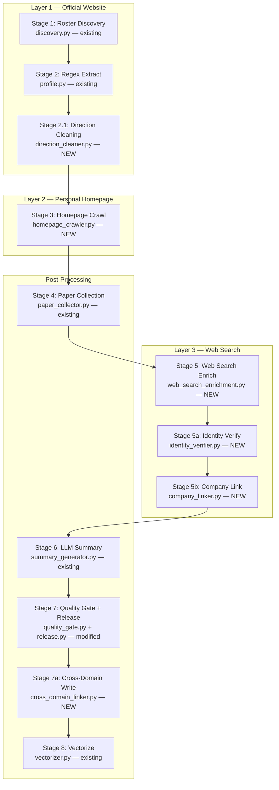

# feat: Professor Pipeline V3 — Three-Layer Collection + Cross-Domain Linking

## Overview

Redesign the professor data pipeline from a single-layer regex scraper (V2) to a three-layer collection system: official website rosters, personal homepage recursive crawling, and web search enrichment with identity verification. Add bidirectional professor-company cross-domain linking. The goal is to raise professor core-field fill rate from 6% `ready` to >80%.

## Problem Frame

Pipeline V2 outputs 3274 professor records with severe quality issues:
- 90% missing `title`, 80% missing `research_directions`, 40% missing `department`
- `research_directions` has regex extraction bugs — courses and education text leak in ("微流控 主讲本科课程：《传感器与检测技术》")
- `company_roles` / `patent_ids` / `top_papers` all empty across 100% of records
- `agent_enrichment.py` passes `html_text=""` (line 451), making LLM gap-filling operate blind
- `profile_summary` / `evaluation_summary` were template garbage (already cleared)
- `WebSearchProvider` exists but is never called in the pipeline

Root cause: V2 only does Layer 1 (roster regex), and Stages 2b/2c rarely succeed due to missing context.

## Requirements Trace

- **R1**: Research direction extraction must be clean — no courses, no education text leakage
- **R2**: Personal homepage recursive crawling to fill title, education, awards, detailed research info
- **R3**: Web search enrichment via Serper to discover external information about professors
- **R4**: Identity verification for web search results — confidence ≥ 0.8 required, false negatives preferred over false positives
- **R5**: Professor-company cross-domain linking — confirmed via LLM, bidirectional writes to SQLite store
- **R6**: `profile_summary` generated via LLM only, no rule-based fallback with padding
- **R7**: Remove `evaluation_summary` from pipeline — not needed for RAG
- **R8**: Per-stage JSONL checkpoints for resume support
- **R9**: Maintain existing V2 infrastructure: async pipeline, LLM tiering, concurrency control, quality gate

## Scope Boundaries

**In scope:**
- Research direction cleaning (regex fix + post-processing)
- Homepage recursive crawler + LLM structured extraction
- Web search enrichment + identity verification
- Company linking with bidirectional store writes
- Pipeline V3 orchestrator wiring all stages
- E2E script with `--limit` and `--institution` support
- Unit tests for all new modules

**Out of scope:**
- Changes to `discovery.py`, `roster.py`, `parser.py`, `name_selection.py` (Layer 1 discovery untouched)
- Patent linking from web search (future — company linking first)
- Google Scholar / DBLP integration (existing Semantic Scholar is sufficient for now)
- Milvus vectorization changes (existing `vectorizer.py` works)
- Admin console frontend changes

## Context & Research

### Relevant Code and Patterns

- `apps/miroflow-agent/src/data_agents/professor/pipeline_v2.py` — V2 orchestrator, async with `asyncio.gather`, semaphore-based concurrency, JSONL resume checkpoint
- `apps/miroflow-agent/src/data_agents/professor/agent_enrichment.py` — LLM structured extraction pattern: build prompt → call LLM → parse JSON → merge with non-overwrite
- `apps/miroflow-agent/src/data_agents/professor/discovery.py::fetch_html_with_fallback` — 3-layer HTML fetching (HTTP → Playwright → Jina), reusable for Layer 2/3
- `apps/miroflow-agent/src/data_agents/professor/cross_domain.py` — `CompanyLink(company_id, company_name, role, evidence_url, source)` model
- `apps/miroflow-agent/src/data_agents/professor/completeness.py` — Weighted field gap assessment, threshold-based trigger
- `apps/miroflow-agent/src/data_agents/providers/web_search.py` — `WebSearchProvider` with Serper API, ready to use
- `apps/miroflow-agent/src/data_agents/storage/sqlite_store.py::update_object` — Supports full-payload replacement for bidirectional writes
- `apps/miroflow-agent/tests/data_agents/professor/test_agent_enrichment.py` — Test pattern: mock LLM client, verify merge behavior

### Institutional Learnings

- **Corporate proxy causes SSL failures** — Use fetch cache at `logs/debug/professor_fetch_cache/`, pipeline checks cache before HTTP requests (see `docs/solutions/professor-pipeline-v2-deployment-patterns-2026-04-05.md`)
- **Domain suffix list must cover all variants** — HIT uses both `hitsz.edu.cn` and `hit.edu.cn`; PKU uses `pkusz.edu.cn` and `pku.edu.cn`
- **Milvus Lite only supports AUTOINDEX** — No HNSW
- **uv fails with SUSTech mirror** — Use `.venv/bin/python` directly

## Key Technical Decisions

- **Precision over recall for identity verification**: Web search results require confidence ≥ 0.8 from LLM verification. Any doubt → discard. This prevents false professor-company associations that would corrupt the knowledge graph (R4)
- **Homepage crawl depth = 1 level of sub-links**: Follow links from the professor's main page to sub-pages (publications, CV, projects) within the same domain. Max 5 sub-pages per professor to bound crawl cost
- **Web search query strategy**: 2-3 queries per professor max (`{name} {institution}`, `{name} {institution} {direction[0]}`, `{name} {institution} 创业 OR 公司`). Max 8 result pages crawled per professor
- **Bidirectional linking via store.update_object**: Read professor → append to `company_roles` → write back. Read company → append to `professor_ids` → write back. Atomic per-record, acceptable for single-writer pipeline
- **Remove evaluation_summary entirely**: Not generated, not stored, not indexed. `ProfessorRecord` contract updated to make it optional
- **LLM-only profile_summary**: If LLM fails, leave `profile_summary` empty rather than generating template garbage. Quality gate marks these as `needs_review`
- **Reuse `fetch_html_with_fallback`**: Layer 2 and Layer 3 crawling reuse the existing 3-layer fetch (HTTP → Playwright → Jina) rather than building a new crawler

## Open Questions

### Resolved During Planning

- **Q: Should Layer 2 and Layer 3 run sequentially or can they overlap?** → Sequential. Layer 2 output (enriched directions, education) provides better context for Layer 3 identity verification
- **Q: How to handle professors whose homepage returns 404?** → Skip Layer 2, proceed directly to Layer 3. Log the failure for future manual review
- **Q: What if a company found via web search is not in our database?** → Still record the `CompanyLink` with `company_id=None`. The link exists in the professor record; backfill company_id when the company is later imported

### Deferred to Implementation

- **Exact prompt wording for identity verification** — Will be tuned during implementation based on initial results
- **Rate limiting values for Serper API** — Depends on API key quota, will be configured in `PipelineV3Config`
- **Whether to cache web search results** — Decision after seeing Serper API latency in practice

## High-Level Technical Design

> *This illustrates the intended approach and is directional guidance for review, not implementation specification. The implementing agent should treat it as context, not code to reproduce.*



**Data model flow:**
```
MergedProfessorProfileRecord (Stage 1-2)
  → clean_research_directions() (Stage 2.1)
  → EnrichedProfessorProfile (Stage 3 homepage merge)
  → EnrichedProfessorProfile (Stage 4 paper merge)
  → EnrichedProfessorProfile (Stage 5 web search merge)
  → ProfessorRecord → ReleasedObject (Stage 7 release)
  → bidirectional store writes (Stage 7a)
```

## Implementation Units

### Phase 1: Foundation Fixes (no new infrastructure)

- [ ] **Unit 1: Research Direction Cleaner**

**Goal:** Clean garbage out of `research_directions` — remove courses, education text, HTML fragments, and overly long items.

**Requirements:** R1

**Dependencies:** None

**Files:**
- Create: `apps/miroflow-agent/src/data_agents/professor/direction_cleaner.py`
- Test: `apps/miroflow-agent/tests/data_agents/professor/test_direction_cleaner.py`

**Approach:**
- Function `clean_directions(raw: list[str]) -> list[str]` that:
  - Truncates items at sentinel phrases: "主讲", "课程", "教育背景", "教材", "科研项目"
  - Drops items matching year ranges (`\d{4}[-–]\d{4}`)
  - Drops items longer than 30 characters (not a research direction)
  - Strips leading/trailing punctuation and whitespace
  - Splits compound items containing "、" or "；" into separate directions
  - Deduplicates case-insensitively
  - Returns empty list rather than garbage

**Patterns to follow:**
- `apps/miroflow-agent/src/data_agents/professor/enrichment.py::normalize_text` — string normalization pattern

**Test scenarios:**
- Happy path: clean list passes through unchanged → `["机器视觉", "图像处理"]` → same output
- Edge case: truncation at sentinel → `"微流控 主讲本科课程：《传感器》"` → `"微流控"`
- Edge case: year range removal → `"《C语言》 教育背景： 2012–2017"` → dropped
- Edge case: long item dropped → 40-char string → dropped
- Edge case: compound split → `"机器视觉、图像处理"` → `["机器视觉", "图像处理"]`
- Edge case: deduplication → `["ML", "ml", "ML"]` → `["ML"]`
- Edge case: empty input → `[]` → `[]`
- Edge case: all items cleaned out → `["主讲课程A", "教育背景2020"]` → `[]`

**Verification:**
- All test scenarios pass
- Run against sample of 100 real professor records, manually spot-check cleaned output

---

- [ ] **Unit 2: Fix agent_enrichment html_text bug + remove evaluation_summary**

**Goal:** Fix the V2 bug where `agent_enrichment` receives empty `html_text=""` (pipeline_v2.py line 451). Remove `evaluation_summary` from release contract.

**Requirements:** R7, R9

**Dependencies:** None

**Files:**
- Modify: `apps/miroflow-agent/src/data_agents/professor/pipeline_v2.py`
- Modify: `apps/miroflow-agent/src/data_agents/professor/release.py`
- Modify: `apps/miroflow-agent/src/data_agents/contracts.py`
- Test: `apps/miroflow-agent/tests/data_agents/professor/test_release.py`

**Approach:**
- In `_process_single_professor`, fetch the professor's profile HTML via `fetch_html_with_fallback` and pass it to `run_agent_enrichment` as `html_text`
- In `release.py::_build_rule_based_summaries`, remove evaluation_summary padding logic
- In `release.py::build_professor_release`, make `evaluation_summary` optional (skip the validation that requires it)
- In `contracts.py::ProfessorRecord`, change `evaluation_summary` from required to optional with default `""`

**Patterns to follow:**
- The HTML fetch is already done in Stage 2b (line 395-399) — reuse the same `fetch_html` helper, store the result for Stage 2c

**Test scenarios:**
- Happy path: agent_enrichment receives non-empty html_text → fields extracted
- Happy path: release succeeds without evaluation_summary
- Edge case: HTML fetch fails → agent_enrichment receives empty string gracefully
- Integration: full pipeline produces ProfessorRecord without evaluation_summary field

**Verification:**
- Existing release tests pass with updated contract
- `agent_enrichment` no longer receives empty html_text in pipeline flow

---

### Phase 2: Layer 2 — Personal Homepage Crawling

- [ ] **Unit 3: Homepage Recursive Crawler**

**Goal:** Recursively crawl professor personal homepages to extract structured data that the official roster page lacks (education, awards, detailed research, title).

**Requirements:** R2

**Dependencies:** Unit 1 (direction cleaner for post-processing homepage directions)

**Files:**
- Create: `apps/miroflow-agent/src/data_agents/professor/homepage_crawler.py`
- Test: `apps/miroflow-agent/tests/data_agents/professor/test_homepage_crawler.py`

**Approach:**
- `async crawl_homepage(profile, fetch_html, llm_client, llm_model) -> HomepageCrawlResult`
- Step 1: Fetch main homepage HTML via `fetch_html_with_fallback`
- Step 2: Extract same-domain links from HTML using `urllib.parse` + `<a href>` parsing
- Step 3: Filter links by relevance keywords (publication, research, cv, 论文, 简历, 获奖 etc.)
- Step 4: Fetch up to 5 relevant sub-pages
- Step 5: Concatenate all page content (truncated to 8000 chars total), call LLM with structured output prompt
- Step 6: Parse `HomepageExtractOutput` (title, department, research_directions, education_structured, work_experience, awards, academic_positions)
- Step 7: Merge into profile using non-overwrite pattern from `agent_enrichment.py::_merge_agent_output`
- Step 8: Clean extracted research_directions via `direction_cleaner.clean_directions`

**Technical design:**

> *Directional guidance, not implementation specification.*

```python
class HomepageExtractOutput(BaseModel):
    title: str | None = None
    department: str | None = None
    research_directions: list[str] = []
    education_structured: list[EducationEntry] = []
    work_experience: list[WorkEntry] = []
    awards: list[str] = []
    academic_positions: list[str] = []

RELEVANT_LINK_KEYWORDS = {
    "publication", "paper", "research", "project", "cv", "resume",
    "group", "lab", "award", "honor", "bio", "about",
    "论文", "发表", "研究", "项目", "简历", "荣誉", "获奖", "课题组", "个人简介",
}
```

**Patterns to follow:**
- `apps/miroflow-agent/src/data_agents/professor/agent_enrichment.py` — LLM prompt → JSON parse → merge pattern
- `apps/miroflow-agent/src/data_agents/professor/discovery.py::fetch_html_with_fallback` — HTML fetching

**Test scenarios:**
- Happy path: homepage with sub-links → extracts education + awards from sub-pages
- Happy path: homepage with no sub-links → extracts from main page only
- Edge case: homepage URL returns 404 → returns original profile unchanged
- Edge case: all sub-links irrelevant → only processes main page
- Edge case: LLM returns invalid JSON → returns original profile, logs warning
- Edge case: sub-page is from a different domain → filtered out
- Edge case: more than 5 relevant links → only first 5 crawled
- Error path: LLM client unavailable → returns original profile with error flag

**Verification:**
- Unit tests pass with mocked HTML and LLM responses
- Manual test on 5 real professors with known homepages, verify extracted data is correct

---

- [ ] **Unit 4: Integrate Homepage Crawler into Pipeline**

**Goal:** Wire `homepage_crawler` into the V3 pipeline between regex extraction and paper collection.

**Requirements:** R2, R8

**Dependencies:** Unit 3

**Files:**
- Modify: `apps/miroflow-agent/src/data_agents/professor/pipeline_v2.py` (will become pipeline_v3 orchestrator)

**Approach:**
- After Stage 2a (regex extract) and direction cleaning, add Stage 3 (homepage crawl)
- Only triggered when `profile.homepage` or `profile.profile_url` exists
- Uses same `fetch_html_with_fallback` and LLM client as other stages
- Append results to `enriched.jsonl` for resume support
- Add homepage crawl metrics to `PipelineV2Report` (rename to V3): `homepage_crawled_count`, `homepage_fields_filled`
- Respect `max_concurrent_homepage` semaphore (default 8)

**Patterns to follow:**
- `pipeline_v2.py::_process_single_professor` — Stage sequencing pattern

**Test scenarios:**
- Integration: professor with homepage → homepage crawled → fields merged into profile
- Integration: professor without homepage → homepage stage skipped
- Integration: homepage crawl failure → pipeline continues to next stage
- Edge case: resume from checkpoint → previously crawled professors skipped

**Verification:**
- Pipeline processes professors through homepage stage
- JSONL checkpoint includes homepage-enriched data

---

### Phase 3: Layer 3 — Web Search + Identity Verification

- [ ] **Unit 5: Identity Verifier**

**Goal:** LLM-based verification that a web page describes the same professor as our target. Core component for precision-first web search enrichment.

**Requirements:** R4

**Dependencies:** None

**Files:**
- Create: `apps/miroflow-agent/src/data_agents/professor/identity_verifier.py`
- Test: `apps/miroflow-agent/tests/data_agents/professor/test_identity_verifier.py`

**Approach:**
- `async verify_identity(professor_context, page_url, page_content, llm_client, llm_model) -> IdentityVerification`
- Professor context: name, institution, department, email, research_directions (known anchor fields)
- LLM prompt asks: "Is this page about the same person?" with structured output
- Output: `IdentityVerification(is_same_person: bool, confidence: float, matching_signals: list[str], conflicting_signals: list[str], reasoning: str)`
- Hard rule: if `confidence < 0.8`, force `is_same_person = False` regardless of LLM output
- Matching signals: name match, institution match, email match, direction overlap
- Conflicting signals: different institution with no transfer evidence, different gender, unrelated field

**Patterns to follow:**
- `apps/miroflow-agent/src/data_agents/professor/agent_enrichment.py` — LLM structured output + JSON parsing pattern

**Test scenarios:**
- Happy path: same person, high confidence → `is_same_person=True, confidence=0.95`
- Happy path: different person same name → `is_same_person=False, confidence=0.3`
- Edge case: confidence exactly 0.8 → accepted
- Edge case: confidence 0.79 → rejected despite LLM saying is_same_person=True
- Edge case: page content is empty → `is_same_person=False, confidence=0.0`
- Edge case: LLM returns malformed JSON → `is_same_person=False` with error log
- Edge case: professor transferred institutions → matching signals include transfer evidence

**Verification:**
- All test scenarios pass
- Manual verification on 10 real search results for known professors

---

- [ ] **Unit 6: Web Search Enrichment Module**

**Goal:** Search the web for additional professor information, crawl result pages, verify identity, extract new data.

**Requirements:** R3, R4

**Dependencies:** Unit 5 (identity verifier)

**Files:**
- Create: `apps/miroflow-agent/src/data_agents/professor/web_search_enrichment.py`
- Test: `apps/miroflow-agent/tests/data_agents/professor/test_web_search_enrichment.py`

**Approach:**
- `async search_and_enrich(profile, search_provider, fetch_html, llm_client, llm_model) -> WebSearchResult`
- Query construction: `build_search_queries(profile)` returns 2-3 queries
  - Primary: `"{name} {institution}"`
  - Academic: `"{name} {institution} {direction[0]}"` if directions exist
  - Company: `"{name} {institution} 创业 OR 创始人 OR 公司"` for company discovery
- Search via `WebSearchProvider.search()`, collect organic results
- Filter out: already-known URLs (profile_url, homepage, evidence_urls), search engine result pages, generic directories
- For each candidate (max 8): fetch page → verify identity → if confirmed, extract new information via LLM
- Separate company mentions for `company_linker` processing
- Merge confirmed information into profile with non-overwrite pattern

**Data models:**
```python
@dataclass
class SearchCandidate:
    title: str
    url: str
    snippet: str
    query: str

@dataclass  
class WebSearchResult:
    profile: EnrichedProfessorProfile
    verified_urls: list[str]
    company_mentions: list[CompanyMention]
    pages_searched: int
    pages_verified: int
```

**Patterns to follow:**
- `apps/miroflow-agent/src/data_agents/providers/web_search.py` — Serper search pattern
- `apps/miroflow-agent/src/data_agents/professor/agent_enrichment.py` — LLM extraction + merge

**Test scenarios:**
- Happy path: search returns results → identity verified → fields merged
- Happy path: company mention found in search results → included in `company_mentions`
- Edge case: all search results fail identity verification → profile unchanged
- Edge case: search API returns empty results → profile unchanged
- Edge case: search API throws exception → profile unchanged, error logged
- Edge case: duplicate URLs across queries → deduplicated before crawling
- Edge case: already-known URL in results → skipped
- Error path: Serper API key invalid → raises, pipeline catches

**Verification:**
- Unit tests pass with mocked search and LLM responses
- Manual test: search for 5 known professors, verify company mentions detected

---

- [ ] **Unit 7: Company Linker + Cross-Domain Writes**

**Goal:** Verify professor-company associations discovered via web search. Write confirmed links bidirectionally to SQLite store.

**Requirements:** R5

**Dependencies:** Unit 5 (identity verifier), Unit 6 (web search — provides `company_mentions`)

**Files:**
- Create: `apps/miroflow-agent/src/data_agents/professor/company_linker.py`
- Create: `apps/miroflow-agent/src/data_agents/professor/cross_domain_linker.py`
- Test: `apps/miroflow-agent/tests/data_agents/professor/test_company_linker.py`
- Test: `apps/miroflow-agent/tests/data_agents/professor/test_cross_domain_linker.py`

**Approach:**

**company_linker.py:**
- `async verify_company_link(professor, company_mention, llm_client, fetch_html) -> CompanyLinkResult | None`
- Fetch company information page (天眼查/企查查/公司官网 URL from search snippet)
- LLM verification prompt: "Is {professor_name} from {institution} associated with {company_name}? What is their role?"
- Output: `CompanyLinkResult(company_link: CompanyLink, verification_confidence: float)`
- Reject if confidence < 0.8
- `CompanyLink.source = "web_search"`

**cross_domain_linker.py:**
- `write_bidirectional_link(store, professor_id, company_link) -> None`
- Professor side: read object → append to `core_facts.company_roles` (avoid duplicates by company_name) → `store.update_object`
- Company side: find company by normalized name → append professor_id to `core_facts.professor_ids` → `store.update_object`
- `find_company_by_name(store, name) -> ReleasedObject | None` — search company domain for matching display_name

**Patterns to follow:**
- `apps/miroflow-agent/src/data_agents/professor/cross_domain.py::CompanyLink` — data model
- `apps/miroflow-agent/src/data_agents/storage/sqlite_store.py::update_object` — store write pattern

**Test scenarios:**
- Happy path: company link verified → CompanyLink returned with role and evidence_url
- Happy path: bidirectional write → professor.company_roles and company.professor_ids both updated
- Edge case: company not in database → CompanyLink with company_id=None, professor side still written
- Edge case: duplicate company link → not appended twice
- Edge case: company verification confidence < 0.8 → returns None
- Edge case: company page fetch fails → returns None
- Error path: store.update_object fails → exception propagated
- Integration: verify + write full flow with test SQLite store

**Verification:**
- Tests pass with mock LLM and real SQLite store (tmp_path fixture)
- After write, both professor and company records contain cross-references

---

### Phase 4: Pipeline Wiring + E2E

- [ ] **Unit 8: Pipeline V3 Orchestrator**

**Goal:** Wire all stages together into `pipeline_v3.py`, replacing V2 as the main pipeline entry point.

**Requirements:** R6, R8, R9

**Dependencies:** Units 1-7

**Files:**
- Create: `apps/miroflow-agent/src/data_agents/professor/pipeline_v3.py`
- Modify: `apps/miroflow-agent/src/data_agents/professor/__init__.py` (export V3)

**Approach:**
- New `PipelineV3Config` extending V2 with: `max_concurrent_homepage`, `max_concurrent_web_search`, `web_search_queries_per_professor`, `identity_confidence_threshold`
- New `PipelineV3Report` extending V2 with: `homepage_crawled_count`, `homepage_fields_filled`, `web_search_count`, `identity_verified_count`, `company_links_confirmed`
- Stage sequence:
  1. Roster Discovery (existing `run_professor_pipeline`)
  2. Regex Extract (existing, part of Stage 1)
  3. Direction Cleaning (Unit 1)
  4. Homepage Crawl (Unit 3) — per-professor, async with semaphore
  5. Paper Collection (existing `enrich_from_papers`)
  6. Web Search + Identity Verification (Unit 6) — per-professor, async with semaphore
  7. Company Linking (Unit 7) — for each company mention from Stage 6
  8. LLM Summary Generation (existing, LLM-only, no fallback padding)
  9. Quality Gate + Release (existing, updated for no evaluation_summary)
  10. Cross-Domain Bidirectional Writes (Unit 7)
  11. Vectorization (existing)
- Per-stage JSONL checkpoints: `homepage_enriched.jsonl`, `web_enriched.jsonl`, `released_objects.jsonl`
- Resume logic: check each checkpoint, skip already-processed professors

**Patterns to follow:**
- `apps/miroflow-agent/src/data_agents/professor/pipeline_v2.py` — overall orchestrator structure, async gather, semaphore, JSONL append, report dataclass

**Test scenarios:**
- Integration: full pipeline with 3 mock professors → all stages execute in order
- Integration: resume from `homepage_enriched.jsonl` → skips homepage stage for completed professors
- Edge case: Layer 2 fails for a professor → continues to Layer 3
- Edge case: Layer 3 fails for a professor → continues to summary/release
- Edge case: `--limit 1` → only processes first professor

**Verification:**
- Pipeline produces enriched professors through all 3 layers
- JSONL checkpoints written at each stage boundary
- Report includes all new metrics

---

- [ ] **Unit 9: E2E Script + Quality Gate Updates**

**Goal:** Update E2E runner and quality gate for V3 pipeline. Run against real data to validate.

**Requirements:** R6, R7

**Dependencies:** Unit 8

**Files:**
- Create: `apps/miroflow-agent/scripts/run_professor_pipeline_v3_e2e.py`
- Modify: `apps/miroflow-agent/src/data_agents/professor/quality_gate.py`
- Modify: `apps/miroflow-agent/src/data_agents/professor/summary_generator.py`

**Approach:**

**E2E script:**
- Similar to V2 E2E but uses `PipelineV3Config` and `run_professor_pipeline_v3`
- CLI args: `--limit`, `--institution`, `--dry-run`, `--skip-vectorize`, `--skip-web-search` (for testing Layer 1+2 only)
- Loads config from env vars: `SERPER_API_KEY`, `DASHSCOPE_API_KEY`, etc.

**Quality gate updates:**
- Remove L1 check for `evaluation_summary` length
- Add L2 marker: `no_homepage_data` when homepage crawl produced nothing
- Add L2 marker: `no_web_search_data` when web search produced nothing

**Summary generator updates:**
- Remove `build_evaluation_summary_prompt` and related validation
- If LLM summary generation fails, set `profile_summary = ""` instead of calling rule-based fallback
- Quality gate marks empty summary as `needs_review`

**Test scenarios:**
- Happy path: E2E with `--limit 2 --skip-vectorize` completes without error
- Happy path: quality gate passes professor with all fields filled
- Edge case: quality gate marks professor with empty profile_summary as `needs_review`
- Edge case: `--skip-web-search` flag skips Layer 3 entirely

**Verification:**
- E2E script runs with `--limit 5` against real URLs
- Quality report shows improved field fill rates vs V2
- No evaluation_summary in any output

---

- [ ] **Unit 10: Batch Re-process Existing Data**

**Goal:** Run V3 pipeline on all 3274 existing professors to upgrade data quality. Write results to the shared SQLite store.

**Requirements:** R1-R9

**Dependencies:** Unit 9

**Files:**
- Modify: `apps/miroflow-agent/scripts/run_professor_pipeline_v3_e2e.py` (add `--write-to-store` flag)
- Modify: `apps/miroflow-agent/scripts/consolidate_to_shared_store.py` (if needed for re-import)

**Approach:**
- Run V3 E2E in batches by institution (7 institutions × ~500 professors each)
- After each institution batch, upsert released objects to shared store
- Run `reassess_quality.py` to update quality status based on new data
- Monitor company link yield — expected: dozens of confirmed links

**Test scenarios:**

Test expectation: none — this is a batch execution task, not a feature implementation.

**Verification:**
- Shared store has 3274+ professor records with improved field fill
- `ready` percentage significantly higher than 6%
- Company links exist in professor records (`company_roles` non-empty for linked professors)
- Bidirectional links: linked companies have `professor_ids` populated

## System-Wide Impact

- **Store writes:** Cross-domain linker writes to both professor and company records in the shared SQLite store. Pipeline is single-writer, so no concurrent write conflicts
- **Admin console:** Will automatically reflect improved data quality — no frontend changes needed. New `company_roles` data visible in professor detail page
- **RAG service:** Improved professor records enhance semantic search quality. No RAG code changes needed
- **Paper domain:** Existing paper staging mechanism (`PaperStagingRecord`) unchanged
- **Vectorization:** Richer professor profiles produce better embeddings. Existing vectorizer handles this automatically
- **Unchanged invariants:** `discovery.py`, `roster.py`, `name_selection.py`, `validator.py` are not modified. Layer 1 discovery behavior is identical to V2

## Risks & Dependencies

| Risk | Likelihood | Impact | Mitigation |
|------|-----------|--------|------------|
| Serper API rate limits or quota exhaustion | Medium | Medium | Configurable queries-per-professor, batch with delays, `--skip-web-search` flag for testing |
| LLM identity verification produces false positives | Low | High | Hard confidence threshold ≥ 0.8, manual spot-check of first batch |
| Homepage crawl triggers anti-scraping blocks | Medium | Low | Existing Playwright/Jina fallback handles most cases; rate limiting per host |
| Corporate proxy blocks Serper API | Low | High | Serper uses HTTPS; if blocked, configure proxy exception for `google.serper.dev` |
| Pipeline runtime too long for 3274 professors | Medium | Medium | Per-stage checkpoints enable resume; `--institution` flag for incremental runs |

## Documentation / Operational Notes

- Update `docs/Professor-Pipeline-V2-User-Guide.md` → V3 with new CLI flags and stage descriptions
- Add `docs/solutions/professor-pipeline-v3-web-search-patterns.md` after first successful batch run
- Monitor Serper API usage dashboard during initial batch processing

## Sources & References

- **Origin document:** [docs/plans/2026-04-06-002-professor-pipeline-v3-redesign.md](docs/plans/2026-04-06-002-professor-pipeline-v3-redesign.md)
- **V2 plan:** [docs/plans/2026-04-05-001-feat-professor-enrichment-pipeline-v2-plan.md](docs/plans/2026-04-05-001-feat-professor-enrichment-pipeline-v2-plan.md)
- **Deployment learnings:** [docs/solutions/professor-pipeline-v2-deployment-patterns-2026-04-05.md](docs/solutions/professor-pipeline-v2-deployment-patterns-2026-04-05.md)
- Related code: `apps/miroflow-agent/src/data_agents/professor/pipeline_v2.py`
- Related code: `apps/miroflow-agent/src/data_agents/providers/web_search.py`
- Related code: `apps/miroflow-agent/src/data_agents/professor/cross_domain.py`
