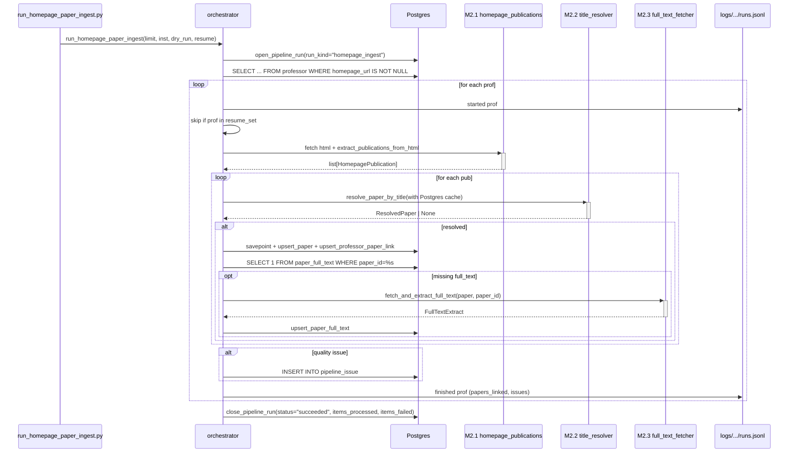

# M2.4 — Homepage Paper Ingest Orchestrator

## Overview

Close the Homepage-Authoritative Pipeline. M2.1 parsed prof homepages for publications, M2.2 resolved those titles to canonical papers via OpenAlex/arxiv/Serper, M2.3 fetched arxiv PDFs and extracted abstract+intro. M2.4 wires the three into an end-to-end ingest script:

1. Iterate every professor with a homepage URL
2. Fetch the homepage HTML (respecting proxy-bypass convention)
3. Extract publications (M2.1)
4. For each publication: resolve title (M2.2) → upsert paper → link professor to paper as `evidence_source_type="personal_homepage"` → if no full text yet, fetch it (M2.3) and persist
5. On any quality anomaly (zero pubs extracted but section detected, all titles unresolvable, etc.), file a `pipeline_issue` row for manual triage
6. Wrap it all in a `pipeline_run` for observability; log structured JSONL progress

Plus a shared V011 migration creating three new tables: `professor_orcid`, `paper_full_text`, `paper_title_resolution_cache` (decided by eng-review: one migration for three RAG-layer tables; see 003 §M2.3).

After M2.4 lands, a random sample of 5-10 professors should run end-to-end against the real DB (`DATABASE_URL`) and meaningfully populate `professor_paper_link` + `paper_full_text`. That's the acceptance bar.

## Problem Frame

001 §4.4 identified the 47% paper-reject rate on the old OpenAlex-author-discovery path. The pipeline inversion insight (user's, codified in 002 §2) is: *homepage publications are authoritative; no LLM gate needed.* M2.1-M2.3 built the pieces. M2.4 is the PR that actually moves the needle for production data.

Without M2.4:
- `homepage_publications.extract_publications_from_html` has no callers in production
- `paper/title_resolver.resolve_paper_by_title` has no callers in production
- `paper/full_text_fetcher.fetch_and_extract_full_text` has no callers in production
- The V011 migration that unlocks downstream work (M6 profile reinforcement, M3 retrieval service storing chunks, etc.) doesn't exist

M2.4 is the single PR that converts 4 milestones of scaffolding into a data-producing pipeline.

## Requirements Trace

- **R1** (from 003 §M2.4): End-to-end script `apps/miroflow-agent/scripts/run_homepage_paper_ingest.py` iterates professors with `homepage_url`, runs the full M2.1→M2.2→M2.3 pipeline, upserts canonical paper + link rows.
- **R2** (from 003 §M2.4): CLI flags `--dry-run`, `--limit N`, `--resume`, `--institution <name>`, `--prof-id <id>`. No writes in dry-run.
- **R3** (from 003 §M2.4): Acceptance — 10 profs with real homepages average ≥ 15 papers linked each (vs. current 0 papers/prof for 47% of profs).
- **R4** (from 003 §M2.3, §M2.2, §M1.3): V011 migration creates `paper_full_text` + `paper_title_resolution_cache` + `professor_orcid` in ONE file. Downgrade-able.
- **R5** (derived): `evidence_source_type="personal_homepage"` (existing enum value) is used on the new links — no enum extension, no additional migration.
- **R6** (derived): `run_id` threading — the orchestrator opens a `pipeline_run`, passes `run_id` to every writer (existing pattern from V007+). On exception, `close_pipeline_run(status="failed", error_summary=...)`.
- **R7** (derived): `--resume` reads `logs/data_agents/paper/homepage_ingest_runs.jsonl` (or similar checkpoint) to skip already-processed prof ids. Skip by `prof_id` set, not by timestamp.
- **R8** (derived): Pipeline_issue rows filed on: (a) HTML fetch returned 404/5xx, (b) publications section detected but < 3 items extracted (M2.1 already logs warning; orchestrator converts to a row), (c) all item resolutions returned None, (d) paper full-text fetch failed for all attempted papers in this prof.
- **R9** (derived): All HTTP uses httpx with `trust_env=False`. Memory: proxy at 100.64.0.15:7893.
- **R10** (derived): Never raise on external flakiness per prof. One prof's failure doesn't kill the run. Orchestrator catches unexpected exceptions, files pipeline_issue, continues.
- **R11** (derived from M2.2): Use `paper_title_resolution_cache` via the new Postgres-backed `TitleResolutionCache` implementation. Cache miss + cascade miss writes nothing (consistent with M2.2).
- **R12** (derived from M2.3): Skip full-text fetch when `paper_full_text` already has a row for this paper_id (idempotency; avoids re-downloading on --resume).

## Scope Boundaries

**In scope:**
- V011 alembic migration (3 tables: `paper_full_text`, `paper_title_resolution_cache`, `professor_orcid`)
- Three sync Postgres writer modules/functions:
  - `upsert_paper_full_text(conn, *, paper_id, extract)`
  - `PostgresTitleResolutionCache` (implements M2.2's Protocol)
  - `upsert_professor_orcid(conn, *, professor_id, orcid, source, confidence)` (writer exists but is unused this PR — included so M1 future work can land without another migration)
- Homepage HTML fetcher helper (httpx, trust_env=False, `_HOMEPAGE_FETCH_GATE` defensive 1 req / 0.5 sec per host)
- Orchestrator function `run_homepage_paper_ingest(conn, *, institution=None, limit=None, dry_run=False, resume_checkpoint_path=None)`
- CLI entrypoint script with argparse
- Pipeline_run wrapping + pipeline_issue filing
- Resume checkpoint — JSONL at `logs/data_agents/paper/homepage_ingest_runs/<run_id>.jsonl` with one line per processed prof
- Integration tests against Postgres test DB (marked `@pytest.mark.integration`, skip when no test DB env var)
- Unit tests for: each writer, orchestrator happy path + each quality-gate branch (mocked DB + mocked M2.1/M2.2/M2.3 helpers)

**Out of scope (deferred):**
- ORCID backfill for professors — `professor_orcid` table is created but no writer is called; M1.3 populates it
- Real-world eval of hit rate — 003 §M1.4 style eval set; defer to M2.4-followup after first real run
- Concurrency / thread pool — sequential over professors; good enough at ~800 profs × few minutes each for overnight run. Concurrency waits until we see the actual latency
- Publisher-specific PDF fallbacks — stays out, same as M2.3
- Retry / backoff across prof runs — the run either completes, crashes, or stops at ctrl-C; `--resume` recovers
- LLM-assisted re-ranking of web-search hits when scholarly-domain filter over-prunes — deferred to M4.3 where retrieval surfaces real gaps
- Integration with M3 Milvus — paper chunks not embedded here; that's M3.3 backfill script
- Backfill invocation in CI — this is a manual overnight-run script, not a scheduled job

## Context & Research

### Relevant Code and Patterns

- **`apps/miroflow-agent/alembic/versions/V010_add_professor_profile_fields.py`** — latest migration, template for V011 (revision strings, upgrade/downgrade shape).
- **`apps/miroflow-agent/alembic/versions/V005a_init_professor_paper_link.py`** — shows enum-value lists kept in Python for test-fixture import (`PROFESSOR_PAPER_EVIDENCE_SOURCE_TYPES`), check-constraint pattern, `postgresql.UUID(as_uuid=True)` with `server_default=gen_random_uuid()`.
- **`apps/miroflow-agent/src/data_agents/storage/postgres/pipeline_run.py`** — `open_pipeline_run` / `close_pipeline_run` helpers. Pass the `run_id` through to every writer. Caller owns commit/rollback; helpers just execute on the open connection.
- **`apps/miroflow-agent/src/data_agents/professor/canonical_writer.py::_upsert_professor_paper_link`** — already exists. Accepts `evidence_source_type`. M2.4 calls it with `"personal_homepage"`. DO NOT modify this file.
- **`apps/miroflow-agent/src/data_agents/paper/canonical_writer.py::upsert_paper`** — already exists. Accepts a `ResolvedPaper`-ish payload. DO NOT modify.
- **`apps/miroflow-agent/src/data_agents/professor/homepage_crawler.py`** — has the existing HTTP fetch primitive (`fetch_homepage_html` or similar). Reuse if it already has `trust_env=False`; if not, build a small focused helper in this PR's new module. Do NOT touch homepage_crawler.py.
- **`apps/miroflow-agent/src/data_agents/normalization.py::build_stable_id`** — ID convention `paper:doi:<doi>` / `paper:arxiv:<id>` / `paper:title:<hash>`. Use this to derive `paper_id` from `ResolvedPaper`.
- **`apps/miroflow-agent/scripts/run_professor_crawler_e2e.py`** — existing script pattern (argparse, `psycopg.connect(DATABASE_URL)`, logging setup). Mirror its shape for CLI.
- **`apps/miroflow-agent/tests/storage/test_pipeline_run.py`** — skipping via `DATABASE_URL_TEST` env var pattern. Replicate for M2.4 DB-backed tests.

### Institutional Learnings

- **`docs/solutions/best-practices/httpx-module-patch-spec-mock-gotcha-2026-04-21.md`** — test-side real-class-capture pattern carries over here.
- **`docs/solutions/workflow-issues/data-agent-real-e2e-gates-2026-04-02.md`** — PRD gap closure must use real-source E2E gates. M2.4 acceptance must include a real-DB dogfood run, not just mocked tests.
- **`docs/solutions/workflow-issues/professor-pipeline-current-findings-and-operating-guidance-2026-04-16.md`** — sanity guidance on professor-pipeline ops (rate limits, dealing with school-specific HTML quirks).
- **`memory/feedback_proxy_llm.md`** — `trust_env=False`. Non-negotiable.
- **`memory/feedback_codex_deviations.md`** — Shapes 1-3 explicit in Codex brief. Anti-drift list in risks.
- **`memory/feedback_data_quality_guards.md`** — TDD guard + SQL cleanup + backfill wire in one round; partial fixes regress. M2.4 must include V011 + writers + orchestrator in one logical PR (even if committed as multiple atomic commits).
- **`memory/feedback_parallel_collection.md`** — parallelize across schools in production, but not in this first-cut. Sequential here.

### External References

- [Alembic op.create_table with enum check constraints](https://alembic.sqlalchemy.org/en/latest/ops.html) — standard pattern.
- [psycopg3 connection lifecycle](https://www.psycopg.org/psycopg3/docs/basic/usage.html) — `with psycopg.connect(...) as conn: with conn.transaction(): ...` for atomic blocks.

## Key Technical Decisions

- **One migration file, three tables.** V011 creates all three because the eng-review on 003 locked this. Keeps the migration count low and batches related schema changes.
- **Single logical PR, multiple atomic commits.** Commit sequence (enforced in execution):
  1. V011 migration (Unit 1)
  2. Three small writer modules (Units 2-4) as one commit: `feat(storage): M2.4a writers for paper_full_text + title cache + professor_orcid`
  3. Orchestrator + CLI (Units 5-7) as `feat(scripts): M2.4b homepage paper ingest orchestrator`
  4. Real-DB dogfood smoke log committed as checkpoint artifact
- **Sync everywhere.** Matches M0.1/M2.1/M2.2/M2.3. Orchestrator runs sequentially. No thread pool.
- **Caller connection.** Writers accept `conn: psycopg.Connection` and execute on it; they do NOT open/close/commit. Orchestrator owns connection lifecycle + transactions.
- **`pipeline_run` wraps the whole orchestrator execution.** One `run_id` threads through every write. On clean exit → `status="succeeded"`. On `KeyboardInterrupt` → `status="cancelled"`. On unexpected exception → `status="failed"` with `error_summary`.
- **Per-prof failure isolation via savepoint.** Wrap each prof's processing in `with conn.transaction(savepoint=True): ...`. One prof's exception rolls back its own writes + files pipeline_issue row, but doesn't abort the outer run.
- **Checkpoint = JSONL at `logs/data_agents/paper/homepage_ingest_runs/<run_id>.jsonl`.** One line per processed prof with `{prof_id, status, papers_linked, pipeline_issues, started_at, finished_at}`. `--resume` reads the most recent file and skips any prof with `status in ("succeeded", "skipped")`.
- **Dry-run semantics:** `--dry-run` means "run the full pipeline, log what WOULD be written, but don't write". All writer calls receive `conn=None` and short-circuit; cache is a no-op in-memory; `pipeline_run` is not opened. Useful for measuring hit rates before committing to real writes.
- **Resume discovery:** `--resume` without a path → auto-detect latest file in `logs/data_agents/paper/homepage_ingest_runs/`. Explicit `--resume <path>` override is supported.
- **Respect M2.3's `paper_full_text` existence check:** Before calling `fetch_and_extract_full_text`, `SELECT 1 FROM paper_full_text WHERE paper_id = %s`. If exists, skip. Saves arxiv bandwidth on re-runs.
- **Postgres-backed cache:** `PostgresTitleResolutionCache(conn)` implements M2.2's Protocol. `get()` does `SELECT resolved FROM paper_title_resolution_cache WHERE title_sha1 = %s AND cached_at > now() - interval '30 days'` (30-day TTL per plan 003 §M2.3). `set()` does `INSERT ... ON CONFLICT DO UPDATE`.
- **`paper_id` derivation:** Orchestrator calls `build_stable_id("paper", "doi:<doi>")` if DOI present; else `"arxiv:<arxiv_id>"` if arxiv present; else `"title:<sha1(title)>:<year>"`. Match existing convention in `paper/canonical_writer.py`.
- **`title_resolution_cache` stores the full `ResolvedPaper` as JSONB.** `get()` deserializes back to `ResolvedPaper` via a small helper. Store the full dataclass so a cache hit returns complete metadata without re-hitting OpenAlex.
- **Homepage HTTP fetcher is a focused new helper**, not a call into `homepage_crawler.py`. Reasons: (a) crawler does a lot more than just HTTP fetch (discovery, depth-limited walking) — we only need one-page fetch; (b) avoids Shape 3 by touching the crawler file again. The new helper lives in the same new module as the orchestrator.
- **Rate-limit per host on homepage fetches:** 0.5 sec between requests to the SAME host (universities often host many prof pages on the same domain). Simple monotonic-time dict keyed by hostname.
- **`pipeline_issue` is the output channel for anomalies, not logs.** `logs/` is for structured JSONL progress; `pipeline_issue` rows are what humans/agents triage later. Each issue row has `run_id`, `issue_type`, `severity`, `target_table`, `target_id`, `message`, `details` (JSONB).
- **Test-first with heavy mocking.** Real DB tests skip when `DATABASE_URL_TEST` missing. Mocked-DB tests cover orchestrator branch logic.

## Open Questions

### Resolved During Planning

- **Q: One migration file or three?** → One. Eng-review on 003 decided.
- **Q: ORCID writer included this PR?** → Yes, table + writer shipped. No caller wired. M1.3 uses it.
- **Q: Per-prof savepoint or full-run transaction?** → Savepoint. One prof's bug must not kill the run.
- **Q: Dry-run writes nothing at all?** → Yes. Not even `pipeline_run` / `pipeline_issue`. Dry-run = pure read.
- **Q: Concurrent over profs?** → Sequential. Concurrency after we measure latency.
- **Q: Cache TTL?** → 30 days (matches plan §V011).
- **Q: Checkpoint location?** → `logs/data_agents/paper/homepage_ingest_runs/<run_id>.jsonl`. Existing `logs/data_agents/` hierarchy convention.
- **Q: What to do when `pipeline_run` is mid-insert and user ctrl-Cs?** → The `with conn.transaction()` context rolls back the in-flight prof; outer run_id is closed with `status="cancelled"` in `finally` block.
- **Q: `homepage_url` column — where does it live?** → `professor.homepage_url` (existing, per `professor/canonical_writer.py`). Query: `SELECT professor_id, canonical_name, institution, homepage_url FROM professor WHERE homepage_url IS NOT NULL`.
- **Q: `institution` filter on the orchestrator — by the free-text institution column or a normalized key?** → Free-text `institution` column, case-insensitive `ILIKE '%...%'`. Good enough for ops filtering; over-engineered normalization not needed here.
- **Q: Reuse M2.3's `paper_full_text` dataclass field `paper_id` or re-derive in the orchestrator?** → Orchestrator derives and passes it explicitly. M2.3 just threads.
- **Q: Store `fetch_error` in `paper_full_text` even when `source="failed"`?** → Yes, so --resume knows which papers have been tried and failed. But make the row nullable everywhere so partial records don't break existing queries.
- **Q: ORCID `confidence` column scale?** → `DECIMAL(3,2)` 0.00-1.00 (plan 003 §M1.3 specifies this). Consistent with existing `authors_display_confidence` conventions in the schema.

### Deferred to Implementation

- **Exact SQL for `upsert_paper_full_text` ON CONFLICT** — PostgreSQL supports `ON CONFLICT (paper_id) DO UPDATE SET ...`; pin the exact columns in the writer.
- **Exact format of `error_summary` on `close_pipeline_run`** — match existing convention in `pipeline_run.py` callers.
- **Default `--limit` when omitted** — None (process all profs). Pin at implementation.
- **Pagination/streaming the professor iteration** — with 800 profs and sequential HTTP fetches, the whole outer query fits in memory. If profs exceed 10k, paginate later. Not this PR.
- **Exact `pipeline_issue` enum values for `issue_type`** — start with `homepage_fetch_error`, `publications_under_threshold`, `all_titles_unresolvable`, `full_text_fetch_failed`, `prof_processing_crashed`. Pin in code; migration to add CHECK constraint is deferred (existing `pipeline_issue` table may already have flexibility).

## High-Level Technical Design

> *Directional guidance. Implementer adapts.*

## Implementation Units

### Phase A — DB Foundation

- [ ] **Unit 1: V011 alembic migration (3 tables)**

**Goal:** Add `paper_full_text` + `paper_title_resolution_cache` + `professor_orcid`.

**Requirements:** R4

**Dependencies:** None.

**Files:**
- Create: `apps/miroflow-agent/alembic/versions/V011_add_rag_tables.py`
- Test: `apps/miroflow-agent/tests/storage/test_v011_migration.py` (new — skip if no test DB)

**Approach:**
- Revision `V011`, down_revision `V010`.
- `paper_full_text`: PRIMARY KEY `paper_id VARCHAR(64)`, `abstract TEXT`, `intro TEXT`, `pdf_url TEXT`, `pdf_sha256 VARCHAR(64)`, `source VARCHAR(32) NOT NULL`, `fetched_at TIMESTAMPTZ NOT NULL DEFAULT now()`, `fetch_error TEXT`. FK to `paper(paper_id)` ON DELETE CASCADE. Index on `source`.
- `paper_title_resolution_cache`: PRIMARY KEY `title_sha1 VARCHAR(40)`, `clean_title_preview VARCHAR(500)`, `resolved JSONB NOT NULL`, `match_source VARCHAR(32)`, `match_confidence DECIMAL(3,2)`, `cached_at TIMESTAMPTZ NOT NULL DEFAULT now()`. Index on `cached_at DESC` for TTL cleanup.
- `professor_orcid`: PRIMARY KEY `professor_id UUID REFERENCES professor(professor_id)`, `orcid VARCHAR(32) NOT NULL UNIQUE`, `source VARCHAR(64) NOT NULL`, `confidence DECIMAL(3,2) NOT NULL`, `verified_at TIMESTAMPTZ NOT NULL DEFAULT now()`.
- Downgrade: drop all three in reverse order.

**Execution note:** Test-first. Write a migration test that runs `alembic upgrade V011` against `DATABASE_URL_TEST`, asserts tables exist with expected columns, then `alembic downgrade V010` removes them.

**Patterns to follow:**
- `alembic/versions/V005a_init_professor_paper_link.py` — enum CHECK constraints pattern (if you need one); not strictly needed for these 3 tables.
- `alembic/versions/V010_add_professor_profile_fields.py` — simplest upgrade/downgrade shape.

**Test scenarios:**
- Happy path — upgrade creates all 3 tables with expected columns (`information_schema.columns` query).
- Happy path — downgrade drops all 3 tables cleanly.
- Happy path — `paper_full_text.paper_id` FK cascades delete from `paper` (insert row, delete parent, confirm gone).
- Integration — run `alembic upgrade head` twice is idempotent (no duplicate error).

**Verification:**
- Migration tests pass via `uv run pytest tests/storage/test_v011_migration.py -n0` (requires `DATABASE_URL_TEST`).
- Downgrade followed by upgrade leaves no orphaned objects.

---

- [ ] **Unit 2: `upsert_paper_full_text` writer**

**Goal:** Idempotent upsert for `paper_full_text` keyed by `paper_id`.

**Requirements:** R4, R12

**Dependencies:** Unit 1.

**Files:**
- Create: `apps/miroflow-agent/src/data_agents/storage/postgres/paper_full_text.py`
- Test: `apps/miroflow-agent/tests/storage/test_paper_full_text_writer.py`

**Approach:**
- `upsert_paper_full_text(conn, *, paper_id: str, extract: FullTextExtract, run_id: UUID | str | None = None) -> None`.
- `ON CONFLICT (paper_id) DO UPDATE SET ...` refreshing every field except `paper_id`.
- Also export `paper_full_text_exists(conn, paper_id: str) -> bool` helper for the orchestrator's skip check.
- Caller owns transaction; writer does not commit.

**Execution note:** Test-first. Integration tests skip when no `DATABASE_URL_TEST`. Unit tests mock psycopg.

**Test scenarios:**
- Happy path — insert new row; SELECT confirms all fields populated.
- Happy path — upsert same `paper_id` with changed `fetch_error` → row replaced; `fetched_at` advanced.
- Happy path — `source="failed"` with all content-None → row inserted; `fetch_error` persisted.
- Edge case — `extract.pdf_sha256=None` → NULL column, no constraint violation.
- Edge case — FK `paper` doesn't exist → `IntegrityError` propagates (orchestrator must upsert paper first).
- Contract — `paper_full_text_exists` returns True after insert, False for missing id.

**Verification:**
- `uv run pytest tests/storage/test_paper_full_text_writer.py -n0`.
- Orchestrator (Unit 6) can call both functions.

---

- [ ] **Unit 3: `PostgresTitleResolutionCache`**

**Goal:** Implements M2.2's `TitleResolutionCache` Protocol against Postgres with 30-day TTL.

**Requirements:** R11

**Dependencies:** Unit 1.

**Files:**
- Create: `apps/miroflow-agent/src/data_agents/storage/postgres/title_resolution_cache.py`
- Test: `apps/miroflow-agent/tests/storage/test_title_resolution_cache.py`

**Approach:**
- `PostgresTitleResolutionCache(conn: psycopg.Connection)` class implementing `get(key) -> ResolvedPaper | None` and `set(key, value) -> None`.
- `get`: `SELECT resolved FROM paper_title_resolution_cache WHERE title_sha1=%s AND cached_at > now() - interval '30 days'`. Deserialize JSONB row into `ResolvedPaper` (tuple authors — serialize list in storage, cast to tuple on read).
- `set`: `INSERT ... ON CONFLICT (title_sha1) DO UPDATE SET resolved=..., cached_at=now(), ...`.
- Caller owns commit.
- Helper `_resolved_to_dict(p) / _dict_to_resolved(d)` — small private functions.

**Execution note:** Test-first.

**Test scenarios:**
- Happy path — set then get returns identical `ResolvedPaper`.
- Happy path — `get` after 31 simulated days (mock `now()` via SQL or skip with real DB) returns None.
- Happy path — set same key twice updates, doesn't insert duplicate.
- Edge case — `authors` tuple survives round-trip (list in JSONB → tuple on read).
- Edge case — `get` for missing key returns None without raising.
- Edge case — `ResolvedPaper.match_confidence=0.85` serializes as `0.85` (not `0.85000001`).

**Verification:**
- Integration tests pass against `DATABASE_URL_TEST`.
- Smoke: import and instantiate from Python.

---

- [ ] **Unit 4: `upsert_professor_orcid` writer**

**Goal:** Minimal writer for the `professor_orcid` table. Not wired in M2.4 orchestrator — M1.3 consumes it.

**Requirements:** R4

**Dependencies:** Unit 1.

**Files:**
- Create: `apps/miroflow-agent/src/data_agents/storage/postgres/professor_orcid.py`
- Test: `apps/miroflow-agent/tests/storage/test_professor_orcid_writer.py`

**Approach:**
- `upsert_professor_orcid(conn, *, professor_id: UUID | str, orcid: str, source: str, confidence: float) -> None`.
- `ON CONFLICT (professor_id) DO UPDATE SET orcid=..., source=..., confidence=..., verified_at=now()`.
- Also export `get_professor_orcid(conn, professor_id) -> str | None` for M1.3 future use.
- Validates ORCID format (`\d{4}-\d{4}-\d{4}-\d{3}[\dX]`) at the boundary — raises `ValueError` on malformed input.

**Execution note:** Test-first.

**Test scenarios:**
- Happy path — insert valid ORCID, get returns same string.
- Happy path — upsert overwrites source/confidence.
- Edge case — malformed ORCID ("12345") → `ValueError`.
- Edge case — unknown `professor_id` FK → `IntegrityError`.
- Edge case — `confidence=0.5` stored as `0.50` with DECIMAL(3,2) precision.

**Verification:**
- Unit tests pass; function unused by this PR's orchestrator but importable.

### Phase B — Orchestration

- [ ] **Unit 5: Homepage HTTP fetcher helper**

**Goal:** Focused sync HTTP fetch for prof homepages. One URL → HTML text or raises.

**Requirements:** R9

**Dependencies:** None.

**Files:**
- Create: `apps/miroflow-agent/src/data_agents/paper/homepage_http.py`
- Test: `apps/miroflow-agent/tests/data_agents/paper/test_homepage_http.py`

**Approach:**
- `fetch_homepage_html(url: str, *, http_client: httpx.Client | None = None) -> str`.
- Per-host rate-limit gate: 0.5s between requests to the same hostname. Module-level dict `_HOST_LAST_FETCH: dict[str, float]` with threading.Lock.
- Owned httpx.Client uses `trust_env=False`, `timeout=30.0`, `follow_redirects=True`.
- Raises `httpx.HTTPStatusError` on 4xx/5xx. Returns text on 2xx.
- Captures response encoding — prefer `response.text`; fallback decodes bytes with charset-detection heuristic if `response.encoding` is None.

**Execution note:** Test-first. Mock httpx responses; assert gate enforcement via patched clock.

**Patterns to follow:**
- `paper/title_resolver.py` and `paper/full_text_fetcher.py` — same `_RateLimitGate` idea but keyed by host. Duplicate the class or inline a tiny variant.

**Test scenarios:**
- Happy path — 200 + body → returns text.
- Happy path — 200 with explicit UTF-8 encoding → body decoded correctly.
- Edge case — 200 with no Content-Type charset → heuristic decode.
- Error path — 404 raises `httpx.HTTPStatusError`.
- Integration — Two calls to same host ≥ 0.5s apart.
- Integration — Two calls to different hosts are NOT rate-limited against each other.

**Verification:**
- All tests pass.
- `trust_env=False` + `follow_redirects=True` asserted on owned client.

---

- [ ] **Unit 6: Orchestrator `run_homepage_paper_ingest` (core logic)**

**Goal:** The brain. Iterates profs, runs pipeline, tracks progress, handles failures.

**Requirements:** R1, R3, R6, R7, R10, R12

**Dependencies:** Units 1-5 + M2.1/M2.2/M2.3 modules (already shipped).

**Files:**
- Create: `apps/miroflow-agent/src/data_agents/paper/homepage_ingest.py`
- Test: `apps/miroflow-agent/tests/data_agents/paper/test_homepage_ingest.py`

**Approach:**
- `run_homepage_paper_ingest(conn, *, institution=None, limit=None, dry_run=False, resume_checkpoint_path=None) -> IngestReport`.
- `IngestReport` frozen dataclass: `run_id`, `profs_total`, `profs_processed`, `profs_skipped`, `papers_linked_total`, `full_text_fetched_total`, `pipeline_issues_filed`, `run_duration_seconds`.
- Flow:
  1. `open_pipeline_run(conn, run_kind="homepage_paper_ingest", run_scope={institution, limit, dry_run})`.
  2. Build checkpoint set from `--resume` file if provided.
  3. Query `SELECT professor_id, canonical_name, institution, homepage_url FROM professor WHERE homepage_url IS NOT NULL [AND institution ILIKE %s] LIMIT %s`.
  4. For each prof:
     - Skip if in checkpoint set.
     - `with conn.transaction(savepoint=True):` — per-prof atomic.
     - `fetch_homepage_html` → `extract_publications_from_html` → count pubs.
     - If < 3 pubs AND a publications section was detected → file pipeline_issue `publications_under_threshold`.
     - Build `PostgresTitleResolutionCache(conn)` OR in-memory dict if `dry_run`.
     - For each pub: `resolve_paper_by_title(...)`, `upsert_paper`, `upsert_professor_paper_link(evidence_source_type="personal_homepage")`.
     - If not `paper_full_text_exists(paper_id)`: `fetch_and_extract_full_text` → `upsert_paper_full_text`.
     - Count papers_linked, full_text_fetched.
     - If all pubs unresolvable → file `all_titles_unresolvable`.
     - Append to checkpoint JSONL.
  5. On any per-prof exception: rollback savepoint, file `prof_processing_crashed` issue, continue.
  6. `close_pipeline_run(status="succeeded", items_processed=profs_processed, items_failed=profs_with_errors)`.
  7. On `KeyboardInterrupt`: `close_pipeline_run(status="cancelled")` in `finally`, re-raise.
  8. On unexpected outer exception: `close_pipeline_run(status="failed", error_summary={"msg": str(exc)})`.

**Execution note:** Test-first. Heavily mocked tests cover branch logic; a small integration test covers end-to-end against `DATABASE_URL_TEST` with a fake homepage HTTP.

**Test scenarios:**

*Happy paths:*
- Happy path — 1 prof with 5 resolvable pubs → 5 papers_linked, 5 paper_full_text upserts.
- Happy path — 1 prof with 3 pubs, 2 resolvable → 2 papers_linked, 0 pipeline_issues.
- Happy path — `--limit 2` processes exactly 2 profs from a 10-prof query.
- Happy path — `--institution 南科大` filters via ILIKE.

*Resume:*
- Integration — checkpoint JSONL with 3 prof_ids → 3 profs skipped, `profs_skipped == 3`.
- Integration — missing checkpoint file → treat as no resume.
- Integration — checkpoint file with partial/corrupt JSON line → skip the line, warn, continue with valid ones.

*Per-prof failure isolation:*
- Error path — 1 of 5 profs raises unexpected RuntimeError inside extract → other 4 complete; pipeline_issue filed for the bad one; run status succeeded.
- Error path — homepage returns 404 → pipeline_issue `homepage_fetch_error`; prof's savepoint rolls back (no link writes).
- Error path — all 3 pubs return `resolve_paper_by_title()=None` → pipeline_issue `all_titles_unresolvable`.
- Error path — < 3 pubs extracted despite pubs section detected → pipeline_issue `publications_under_threshold`.

*Dry-run:*
- Contract — `dry_run=True` causes 0 writes (spy on every upsert: call_count=0).
- Contract — `dry_run=True` still produces a non-empty `IngestReport` with `profs_processed > 0`.
- Contract — `dry_run=True` does NOT open a pipeline_run row.

*Cancellation:*
- Error path — `KeyboardInterrupt` during prof iteration → `close_pipeline_run(status="cancelled")` observed.

*Full-text short-circuit:*
- Contract — `paper_full_text_exists=True` → `fetch_and_extract_full_text` NOT called.

**Verification:**
- All mocked tests pass.
- Integration test with `DATABASE_URL_TEST` + fixture homepage HTML + real writers produces the expected row counts.

---

- [ ] **Unit 7: CLI entrypoint**

**Goal:** `scripts/run_homepage_paper_ingest.py` — thin argparse shell over Unit 6.

**Requirements:** R2, R7

**Dependencies:** Unit 6.

**Files:**
- Create: `apps/miroflow-agent/scripts/run_homepage_paper_ingest.py`
- Test: `apps/miroflow-agent/tests/scripts/test_run_homepage_paper_ingest.py` (argparse + smoke only)

**Approach:**
- Argparse flags: `--dry-run`, `--limit INT`, `--institution STR`, `--prof-id UUID`, `--resume [PATH]`, `--log-level`.
- Main: `psycopg.connect(os.environ["DATABASE_URL"])` (fail fast on missing env), call `run_homepage_paper_ingest`.
- Print `IngestReport` as JSON at end.
- Exit code 0 on clean runs (including `--dry-run` and partial failures that file pipeline_issues). Exit 1 on unhandled exception.

**Execution note:** Test-first; argparse tests run without DB.

**Test scenarios:**
- Happy path — `--help` emits usage.
- Happy path — `--dry-run --limit 5` parses, dispatches to orchestrator with correct kwargs.
- Happy path — `--resume` without arg auto-detects latest file (patched filesystem).
- Edge case — `--prof-id` + `--institution` both set → both filters apply (orchestrator receives both).
- Error path — `DATABASE_URL` env missing in non-dry-run → exit 1 with clear message.

**Verification:**
- Script runs `--help` cleanly.
- Unit tests pass.
- Manual smoke: `DATABASE_URL_TEST=... python scripts/run_homepage_paper_ingest.py --dry-run --limit 2` prints a JSON report.

---

- [ ] **Unit 8: Real-DB dogfood smoke + acceptance log**

**Goal:** Prove the whole stack works end-to-end against the real dev DB before merging.

**Requirements:** R3

**Dependencies:** Units 1-7 on DB with V011 applied.

**Files:**
- Create: `docs/solutions/integration-issues/homepage-paper-ingest-2026-04-21-dogfood.md` (or similar date-stamped note)

**Approach:**
- Run `scripts/run_homepage_paper_ingest.py --limit 10 --dry-run` against `DATABASE_URL` locally (user's dev DB).
- Record: profs processed, per-prof pub counts, resolution hit rates per source (OpenAlex / arxiv / Serper / cache), full-text fetch success rate.
- Then run without `--dry-run` on 5 profs: confirm `SELECT count(*) FROM professor_paper_link WHERE evidence_source_type='personal_homepage'` increments by the expected amount.
- Note surprises, issues, or degradation modes.
- Commit the log as a solutions entry.

**Test scenarios:** Not applicable — this is a manual acceptance step.

**Verification:**
- Log committed; manual verification of row counts matches report.
- If hit rate < 15 papers/prof average, file follow-up TODOs (not blocking).

## System-Wide Impact

- **Interaction graph:** Orchestrator is the first production caller of M2.1/M2.2/M2.3. First production path that writes to `paper`, `professor_paper_link`, `paper_full_text`, `paper_title_resolution_cache`. `pipeline_run` + `pipeline_issue` flow through the run.
- **Error propagation:** Per-prof savepoints isolate failures. Outer run survives all per-prof issues; only re-raises on `KeyboardInterrupt` (records cancelled) and truly unhandled bugs (records failed).
- **State lifecycle risks:** Transaction boundaries — the orchestrator MUST not leave stray savepoints. The `with conn.transaction(savepoint=True):` context guarantees release. Checkpoint JSONL is append-only; corrupted lines are non-fatal but warned.
- **API surface parity:** V011's 3 tables become contracts for M1.3, M3.3, M6. Additive schema changes are fine; column renames break downstream.
- **Integration coverage:** Unit 6's integration test with `DATABASE_URL_TEST` + fixture HTML + real writers is the primary end-to-end check. Unit 8's real-DB dogfood is the acceptance gate.
- **Unchanged invariants:** `professor/canonical_writer.py`, `paper/canonical_writer.py`, `paper/title_resolver.py`, `paper/full_text_fetcher.py`, `professor/homepage_publications.py`, `providers/web_search.py`, existing migrations V001-V010 — all UNMODIFIED. Verified by `git diff --stat` before commit.

## Risks & Dependencies

| Risk | Mitigation |
|------|------------|
| V011 migration runs against prod DB at an unplanned time | Migrations require explicit `alembic upgrade head`; M2.4 PR does NOT auto-run migrations. User decides when to apply. |
| `paper_title_resolution_cache` fills with garbage from bad OpenAlex responses | 30-day TTL + `match_confidence` column lets M4 inspect and re-resolve. Hard truncation is available as an ops script later. |
| `paper_full_text` grows unbounded as we scale | 4-page pdfminer cap + 30MB download cap + intro 3000-char cap keep per-row size modest (≤10KB typical). At 8000 papers × 10KB = 80MB, fine for years. |
| Per-host rate-limit gate holds up the orchestrator on single-university runs | 0.5s per host × ~100 profs per school = 50s of added latency. Acceptable. If intolerable, add parallelism keyed by host in M2.4-followup. |
| Codex over-touches existing writers to "helpfully" share code (Shape 3) | Brief explicitly lists NO TOUCH targets: `professor/canonical_writer.py`, `paper/canonical_writer.py`, `paper/title_resolver.py`, `paper/full_text_fetcher.py`, `professor/homepage_publications.py`, `providers/web_search.py`, V001-V010 migrations. Cross-validation `git diff --stat` catches. |
| Codex introduces pytest fixtures that connect to live prod DB | Tests guard with `DATABASE_URL_TEST` env; unit tests mock `psycopg.Connection`. Integration tests skip when env missing. |
| Dry-run accidentally writes anything | Dry-run test asserts 0 calls to every writer via spies. Integration test in dry-run mode runs against `DATABASE_URL_TEST` and asserts `SELECT count` stays constant. |
| Resume file gets corrupted mid-write (crash) | JSONL append-only; corrupted final line is detected on parse and skipped with warning. Checkpoint reader handles partial lines gracefully. |
| Per-prof savepoint interacts badly with `open_pipeline_run`'s timestamp | `pipeline_run` rows live in the outer transaction; savepoints are nested. PG semantics: savepoint rollback keeps the outer INSERT. Verified by existing pattern in `storage/postgres/pipeline_run.py` callers. |
| Orchestrator gets rate-limited by OpenAlex when processing 100+ profs × 20 pubs × 3 sources | M2.2's gates enforce per-process limits. Worst case ~20 pubs × 3 sources × 100 profs = 6000 cascade attempts, with title cache the actual unique API calls are much fewer on re-runs. Accept. |
| `professor.homepage_url` is set but URL is stale/broken | `homepage_fetch_error` pipeline_issue rows surface this. Not a blocker. |
| Very long homepages with 200+ publications trigger M2.1's 200-cap warning | That's working as designed; warning surfaces as `publications_under_threshold`'s inverse (publications_over_cap). File pipeline_issue of a different type? Decide at implementation; for now log but don't file issue. |
| Integration tests flaky due to real network (if someone forgets to mock) | M2.4 is committed to hermetic unit tests (mocked HTTP and mocked M2.1/M2.2/M2.3 helpers). Unit 8 dogfood is out-of-CI; only manual. |

## Documentation / Operational Notes

- Doc impact: `docs/Professor-Pipeline-V2-User-Guide.md` (if it exists; otherwise add a new `docs/Homepage-Paper-Ingest-Operating-Guide.md` follow-up) — how to run, what flags mean, where to find logs, how to recover from partial runs. Defer to a separate small PR after the first real run produces operational experience.
- Rollback plan: `alembic downgrade V010` drops the 3 tables. No data loss outside those tables. If operator has populated `paper_full_text` and later wants to roll back, a backup is recommended; not automated.
- New env vars: none. `DATABASE_URL` + `SERPER_API_KEY` are already standard.
- Monitoring: `pipeline_issue` table accumulates anomalies. Admin console (existing) already shows pipeline_issues.

## Phased Delivery

### Phase A — Land Before Phase B

- Unit 1: V011 migration
- Units 2-4: three writers (one commit)

Before Phase B merges, run `alembic upgrade V011` against the dev DB. Phase A is independently useful (unblocks M1.3 future work to land `professor_orcid` writes; M2.2's cache can't be wired until `paper_title_resolution_cache` exists).

### Phase B — Land After Phase A

- Unit 5: homepage HTTP fetcher
- Unit 6: orchestrator
- Unit 7: CLI
- Unit 8: real-DB dogfood log

Phase B requires Phase A merged (needs the tables). Committing sequence keeps git history comprehensible and lets review happen in two chunks.

## Sources & References

- **Origin:** `docs/plans/2026-04-20-003-agentic-rag-execution-plan.md` §M2.4
- **Upstream:** 2026-04-21-001 (M2.1), 2026-04-21-002 (M2.2), 2026-04-21-003 (M2.3)
- **Design context:** `docs/plans/2026-04-20-002-agentic-rag-implementation-design.md` §2
- **Patterns:**
  - `apps/miroflow-agent/alembic/versions/V005a_init_professor_paper_link.py` (enum + FK)
  - `apps/miroflow-agent/alembic/versions/V010_add_professor_profile_fields.py` (minimal shape)
  - `apps/miroflow-agent/src/data_agents/storage/postgres/pipeline_run.py` (run lifecycle)
  - `apps/miroflow-agent/src/data_agents/professor/canonical_writer.py::_upsert_professor_paper_link` (existing writer reused)
  - `apps/miroflow-agent/src/data_agents/paper/canonical_writer.py::upsert_paper` (existing writer reused)
  - `apps/miroflow-agent/scripts/run_professor_crawler_e2e.py` (CLI shape)
- **Learnings:**
  - `docs/solutions/workflow-issues/data-agent-real-e2e-gates-2026-04-02.md` — real E2E gate required
  - `docs/solutions/best-practices/httpx-module-patch-spec-mock-gotcha-2026-04-21.md` — test patching
  - `memory/feedback_codex_deviations.md` Shapes 1-3
  - `memory/feedback_proxy_llm.md`, `memory/feedback_data_quality_guards.md`
