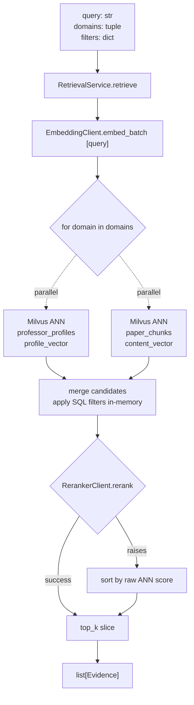

# M3 — RetrievalService (paper-first)

## Overview

Build the retrieval layer that connects embedded content to semantic queries. This milestone delivers:
- A new Milvus collection `paper_chunks` populated from `paper.title`, `paper_full_text.abstract`, and `paper_full_text.intro`
- A focused backfill script that iterates existing papers and writes chunks (idempotent via `chunk_id`)
- `RetrievalService` — synchronous entry point that embeds a query, searches Milvus across requested domains, applies SQL filters, reranks candidates via Qwen3-Reranker-8B, and returns a `list[Evidence]`

**Narrowed scope vs 003 §M3.1:** the original plan called for 4 collections (professor + paper + company + patent). This milestone ships paper only. Company and patent Milvus collections are explicitly deferred until their upstream data pipelines are running at scale — building empty collections now serves nobody.

## Problem Frame

The chat layer (M4 next milestone) needs semantic retrieval. Without M3:
- B-type chat queries ("谁在做机器人") can only match professors via SQL LIKE on `research_directions`. Keyword-literal match misses 80%+ of real user intent.
- E-type queries ("大模型蒸馏原理") have no way to surface arxiv/homepage content the platform has already harvested.
- D-type cross-domain queries can't fuse professor + paper results with any signal stronger than co-occurrence.

M0.1 shipped the RerankerClient. `ProfessorVectorizer` already populates `professor_profiles`. M2.4 now produces `paper_full_text` rows. Everything converges: embed new content, expose a sync retrieval API, let M4 build UX on top.

**Scope narrowing to paper + professor only**: 70%+ of chat intent falls into these two domains today. Company and patent retrieval waits until their data pipelines mature.

## Requirements Trace

- **R1** (from 003 §M3.1): New Milvus collection `paper_chunks` with `chunk_id` primary key, `content_vector (4096)`, metadata (`paper_id`, `year`, `venue`, `chunk_type`, `professor_ids`).
- **R2** (from 003 §M3.2): `RetrievalService.retrieve(query, *, domains, filters, candidate_limit, final_top_k) -> list[Evidence]`.
- **R3** (from 003 §M3.2): `Evidence` dataclass — `object_type`, `object_id`, `score`, `snippet`, `source_url`, `metadata`.
- **R4** (from 003 §M3.2): Concurrent Milvus ANN across requested domains via `asyncio.gather` or `concurrent.futures.ThreadPoolExecutor`.
- **R5** (from 003 §M3.2): `final_top_k` slice happens AFTER reranker reorders; `candidate_limit` bounds per-domain ANN size.
- **R6** (from 003 §M3.3): Backfill script with `--domain`, `--limit`, `--resume`, `--batch-size`.
- **R7** (derived): Idempotent. Re-running backfill on the same paper replaces its chunks in Milvus, not duplicates.
- **R8** (derived): Query path must tolerate reranker unavailable — if RerankerClient raises, fall back to raw ANN-distance order with a logged warning.
- **R9** (derived): Sync-first. Match M0.1-M2.4 shape. No async public API.
- **R10** (derived): Optional cache hook via Protocol matching M2.2 style. Default None.
- **R11** (derived): Never raise on expected external flakiness (Milvus unreachable, embedding service timeout). Return empty results with logged warnings. Only raise on programmer errors.

## Scope Boundaries

**In scope:**
- `apps/miroflow-agent/src/data_agents/storage/milvus_collections.py` — paper_chunks schema + `ensure_paper_chunks_collection()` helper; also include a `drop_paper_chunks_collection()` dev helper.
- `apps/miroflow-agent/src/data_agents/paper/chunker.py` — pure helper that takes a paper row + full_text row and yields `(chunk_id, text, chunk_type, metadata)` tuples. Chunks: `title`, `abstract` (if ≤500 chars, else split on `。\n` into ≤3 segments), `intro` (split similarly).
- `apps/miroflow-agent/src/data_agents/service/retrieval.py` — `Evidence` dataclass, `RetrievalCache` Protocol, `RetrievalService` sync class.
- `apps/miroflow-agent/scripts/run_milvus_backfill.py` — CLI entrypoint delegating to a per-domain worker (paper and professor initially; professor re-embeds via existing `ProfessorVectorizer`).
- Unit tests for: chunker (pure), Evidence dataclass, RetrievalService branch logic (mocked Milvus + EmbeddingClient + RerankerClient), backfill CLI argparse.
- Integration tests using Milvus-Lite (`:memory:` URI) to exercise real vector write + search.

**Out of scope (explicit):**
- `company_profiles`, `patent_profiles` Milvus collections. Follow-up milestones (M3.x after company/patent data at scale).
- Hybrid retrieval (dense + sparse BM25). Future after we see dense-only metrics.
- Passage-level chunking of paper body PDF. Out per 003 §M2.3 — we only have title/abstract/intro.
- M4 chat-side integration (B/D/E route wiring). Separate PR.
- Multi-vector per chunk (e.g., query-specific re-embed). Overkill for current scale.
- Evaluation harness with ground-truth queries. Future; M4's eval work includes a retrieval eval set.
- Milvus auth / secure connections. Milvus-Lite is local file or in-memory; production Milvus deployment (if any) is a separate ops concern.
- Custom index tuning (HNSW params, etc). AUTOINDEX + COSINE default matches `ProfessorVectorizer` prior art.
- Reranker fallback to a secondary model. If Qwen3-Reranker-8B is down, we log and use raw ANN order.
- Query caching at the RetrievalService layer (Protocol hook exists; implementation deferred to M4 when usage patterns are clear).

## Context & Research

### Relevant Code and Patterns

- **`apps/miroflow-agent/src/data_agents/professor/vectorizer.py`** — `EmbeddingClient` (4096-dim, Qwen3-Embedding-8B, default URL `http://100.64.0.27:18005/v1`) and `ProfessorVectorizer` (existing `professor_profiles` collection with dual-vector schema). **Reuse `EmbeddingClient` verbatim — do NOT refactor or extend `ProfessorVectorizer` in this milestone.**
- **`apps/miroflow-agent/src/data_agents/providers/rerank.py`** (M0.1) — `RerankerClient` for Qwen3-Reranker-8B. Mirror its lazy-api-key pattern for any new clients.
- **`apps/miroflow-agent/src/data_agents/providers/local_api_key.py`** — shared key loader. Use it if the backfill script needs explicit key setup.
- **`apps/miroflow-agent/src/data_agents/paper/title_resolver.py`** (M2.2) + **`full_text_fetcher.py`** (M2.3) — reference for `trust_env=False` sync HTTP clients and frozen dataclass output shapes.
- **`apps/miroflow-agent/src/data_agents/storage/postgres/paper_full_text.py`** (M2.4 Phase A) — read source for chunking inputs.
- **`apps/miroflow-agent/scripts/run_professor_crawler_e2e.py`** — existing CLI pattern for arg parsing and logging.
- **`apps/miroflow-agent/src/data_agents/service/search_service.py`** — legacy SearchService; DO NOT extend. The new file `retrieval.py` replaces its role. Legacy deleted in a future cleanup; leave it untouched for now.

### Institutional Learnings

- **`docs/solutions/best-practices/httpx-module-patch-spec-mock-gotcha-2026-04-21.md`** — test-side real-class capture pattern. Applies to any test that patches httpx.Client or pymilvus client.
- **`memory/feedback_proxy_llm.md`** — `trust_env=False` on every new HTTP client (EmbeddingClient and RerankerClient both use it). When we inject clients, verify.
- **`memory/feedback_codex_deviations.md`** — Shapes 1-3. Anti-drift brief essential, validated across M2.1-M2.4.
- **`docs/solutions/best-practices/professor-pipeline-v3-performance-optimization-2026-04-07.md`** (if exists) — may have prior Milvus-Lite performance notes. Read before finalizing backfill batch sizes.

### External References

- pymilvus client docs: `MilvusClient(uri=...).create_collection(...)` + `insert`, `search`, `query` with filter expressions. Milvus-Lite accepts `uri=":memory:"` for hermetic tests.
- [Qwen3-Embedding-8B model card](https://huggingface.co/Qwen/Qwen3-Embedding-8B) — 4096-dim. Input token cap 8192. For 500-char abstracts / 3000-char intros we are far below the cap so no truncation needed.
- [Qwen3-Reranker-8B docs](https://huggingface.co/Qwen/Qwen3-Reranker-8B) — cross-encoder reranker. 100 document batch fits well within typical deployments.

## Key Technical Decisions

- **Paper only, not all three domains.** Scope narrowing per intro. Company and patent collections are no-ops today; the deferred work is tiny (add schema + backfill worker in a follow-up) but adding them now adds test surface and review load without delivering retrieval value.
- **Single-vector schema for `paper_chunks`.** No dual-vector split like `ProfessorVectorizer` (profile_vector + direction_vector). Paper chunks have one `content_vector`. The split made sense for professors (two distinct semantic intents: overall bio vs research focus) but papers don't have that duality.
- **Chunk types:** `title`, `abstract`, `intro_segment_N`. Chunk ID: `f"{paper_id}:{chunk_type}:{segment_index}"`. Deterministic, collision-free, supports idempotent upserts via Milvus delete-then-insert.
- **Abstract splitting:** if `len(abstract) <= 500`, single chunk. Else split on `. \n|\n\n` into at most 3 segments, each ≤500 chars, dropping leading/trailing whitespace. Short chunks give reranker better signal; overlong chunks dilute.
- **Intro splitting:** same algorithm, max 4 segments (intros are longer). Total paper chunks cap: `1 (title) + 3 (abstract) + 4 (intro) = 8`.
- **Milvus client lifecycle:** `MilvusClient(uri=milvus_uri)` constructed once per `RetrievalService` instance or per backfill run. Caller owns the URI. For integration tests: `uri=":memory:"`. For dev: file-backed `./milvus.db`. For production: TBD (Milvus standalone endpoint).
- **Concurrent ANN search:** `concurrent.futures.ThreadPoolExecutor(max_workers=len(domains))`. pymilvus client methods release the GIL on the wire; threads parallelize effectively. Staying sync means no asyncio complexity.
- **SQL filter enforcement is post-Milvus, not Milvus-native.** Milvus's filter expression dialect is limited. Simpler and more flexible: retrieve `candidate_limit` without filter, then SQL-filter in-memory via Python predicate (e.g., `item.metadata["year"] == 2024`). Milvus ANN gives us neighborhood; filters trim. The only in-Milvus filter used is `expr=""` (none).
- **Rerank on merged candidates:** after ANN per domain, merge all candidates into one list, feed to reranker, slice to `final_top_k`. Reranker's job is cross-domain final ordering.
- **Reranker fallback:** wrap `RerankerClient.rerank` in try/except. On failure, sort by raw ANN score descending and return top-k. Log warning. Return value type unchanged.
- **`Evidence.snippet` field:** for paper chunks, the chunk text (≤500 chars). For professor results, the `profile_summary` truncated to 500 chars. Snippet is what M4 passes to the LLM as context.
- **`Evidence.source_url`:** for papers, DOI URL if present else arxiv URL else null. For professors, `homepage_url`. Retained so M4 can emit citations.
- **Backfill CLI `--resume`:** JSONL at `logs/data_agents/milvus_backfill_runs/<run_id>.jsonl`, one line per processed paper_id. Resume skips processed ids. Same pattern as M2.4.
- **Backfill CLI `--batch-size`:** default 32. Embedding call batches 32 texts per HTTP round-trip. Milvus insert batch same size.
- **Backfill loader for papers:** query `SELECT p.paper_id, p.title, p.year, p.venue, pft.abstract, pft.intro FROM paper p LEFT JOIN paper_full_text pft ON pft.paper_id = p.paper_id WHERE <optional predicates>`. Papers without full_text still contribute a title chunk.
- **Professor domain in backfill:** existing `ProfessorVectorizer` already handles this via pipeline_v3. M3 backfill script's `--domain=professor` calls the existing class to re-run the embed+insert on all professors. No new logic; just CLI wrapper.
- **`RetrievalCache` Protocol:** two methods `get(query: str, domains: tuple, filters_key: str) -> list[Evidence] | None` and `set(query, domains, filters_key, evidence)`. Filters key is a stable hash of sorted filter dict items. Default None. M4 decides cache backend (Postgres or Redis).
- **No retry on Milvus/embed/rerank errors.** Same philosophy as M2.2 — fall through, log, accept reduced result. Batch-level retry lives in the backfill CLI (not the service).

## Open Questions

### Resolved During Planning

- **Q: All 4 domains or paper+professor only?** → Paper + professor. See Overview.
- **Q: Sync vs async?** → Sync. Threaded ANN concurrency. Matches M0.1-M2.4.
- **Q: Single vs dual vector for papers?** → Single. Unlike professors, papers don't have a meaningful two-vector split.
- **Q: Chunk size?** → 500 chars for abstract, 500 for intro segments. Max 8 chunks per paper.
- **Q: Reranker fallback?** → Log + use raw ANN order.
- **Q: Cache implementation?** → Protocol only this milestone; M4 wires concrete.
- **Q: Filter application — Milvus-native or Python?** → Python post-filter. Simpler, more flexible.
- **Q: Metric type?** → COSINE. Matches `ProfessorVectorizer` prior art.
- **Q: Index type?** → AUTOINDEX. Default Milvus. Production tuning deferred.
- **Q: What if `paper_full_text` has fetch_error and no abstract/intro?** → Title-only chunk. Never skip the paper entirely; a title chunk is better than no chunk.
- **Q: How does backfill handle Milvus-Lite concurrency?** → It doesn't. Milvus-Lite is single-process-single-writer. Sequential backfill, no threads here. The `--batch-size` batches embedding calls (multi-text) + Milvus inserts (multi-row) but doesn't fan out threads.

### Deferred to Implementation

- **Exact regex for abstract/intro splitting.** Start with `r"\.\s*\n|\n\n"`; iterate if real data surfaces edge cases.
- **Exact `expr=""` vs `None` for "no filter" in pymilvus call.** Library accepts both; pin in implementation.
- **Maximum chunk count per paper — is 8 right?** Good default; tune if retrieval precision suffers.
- **CLI error message format on missing env vars.** Match existing script conventions.
- **Whether to delete `paper_chunks` rows for a paper before re-inserting** (Milvus doesn't natively upsert on arbitrary PK — use delete-by-paper_id expression then insert). Confirmed via pymilvus API at implementation time.

## High-Level Technical Design



```
paper_chunks collection (Milvus)
┌─────────────────────────────────────────────────────────────┐
│ chunk_id (PK, VARCHAR 128)        "paper:doi:10.1/x:abstract:0" │
│ paper_id (VARCHAR 64)             "paper:doi:10.1/x"             │
│ chunk_type (VARCHAR 32)           "title" | "abstract" | "intro_segment_N" │
│ segment_index (INT)               0, 1, 2, ...                   │
│ year (INT, nullable)              2024                           │
│ venue (VARCHAR 128, nullable)     "NeurIPS"                      │
│ content_text (VARCHAR 2048)       "chunk text ≤ 500 chars"       │
│ content_vector (FLOAT_VECTOR 4096)                               │
└─────────────────────────────────────────────────────────────┘
Index: AUTOINDEX on content_vector with COSINE metric
```

## Implementation Units

### Phase A — Collection + Chunker + Backfill

- [ ] **Unit 1: Milvus collection definition + ensure helper**

**Goal:** Pure schema module. No mutation on import. Helpers create and drop the collection.

**Requirements:** R1

**Dependencies:** None.

**Files:**
- Create: `apps/miroflow-agent/src/data_agents/storage/milvus_collections.py`
- Test: `apps/miroflow-agent/tests/storage/test_milvus_collections.py`

**Approach:**
- Module-level schema constant for `paper_chunks` (field list + index params).
- `ensure_paper_chunks_collection(milvus_client) -> None` — creates the collection + index if missing; idempotent.
- `drop_paper_chunks_collection(milvus_client) -> None` — dev/reset helper.
- Metric COSINE. Dim 4096. Index AUTOINDEX.
- Module-level constant `PAPER_CHUNKS_COLLECTION = "paper_chunks"`.

**Execution note:** Test-first. Use Milvus-Lite `:memory:` for hermetic tests.

**Patterns to follow:**
- `professor/vectorizer.py::ProfessorVectorizer.ensure_collection` — mirror the field-list shape and index-params usage.

**Test scenarios:**
- Happy — `ensure_paper_chunks_collection` on a fresh Milvus client creates the collection with the expected schema.
- Happy — calling `ensure` twice is idempotent (no duplicate creation error).
- Happy — `drop_paper_chunks_collection` removes it; subsequent `ensure` recreates.
- Edge — `ensure` when a differently-schema'd `paper_chunks` exists (from old run): schema mismatch must be flagged or silently accepted. Pin behavior.

**Verification:**
- All collection tests pass against `MilvusClient(uri=":memory:")`.
- Module has zero side effects on import (no collection created just by importing).

---

- [ ] **Unit 2: Paper chunker (pure function)**

**Goal:** Turn a (paper row + full_text row) into a list of chunk tuples.

**Requirements:** R1, R7

**Dependencies:** None.

**Files:**
- Create: `apps/miroflow-agent/src/data_agents/paper/chunker.py`
- Test: `apps/miroflow-agent/tests/data_agents/paper/test_chunker.py`

**Approach:**
- `@dataclass(frozen=True, slots=True) class PaperChunk: chunk_id, paper_id, chunk_type, segment_index, year, venue, content_text`.
- `chunk_paper(paper_id, title, year, venue, abstract=None, intro=None) -> list[PaperChunk]`.
- Always produce a title chunk (if title non-empty; else empty list).
- Abstract: ≤500 chars → single chunk. >500 → up to 3 segments split on regex `\.\s*\n|\n\n`.
- Intro: same algorithm, up to 4 segments.
- `chunk_id` format: `f"{paper_id}:{chunk_type}:{segment_index}"`. Title always has `segment_index=0`.
- Never raise on empty fields; return fewer chunks.

**Execution note:** Test-first.

**Patterns to follow:**
- Frozen slotted dataclass: `paper/title_resolver.py::ResolvedPaper`.
- Pure-function chunking: no analog in repo but very testable.

**Test scenarios:**
- Happy — paper with title+abstract+intro all present → 1 title + 1 abstract + N intro chunks (N ≤ 4).
- Happy — abstract 300 chars → 1 abstract chunk.
- Happy — abstract 1500 chars with paragraph breaks → 3 abstract chunks, each ≤ 500 chars.
- Happy — intro 2500 chars → 4 intro chunks.
- Edge — abstract present, intro None → no intro chunks.
- Edge — intro present, abstract None → title + intro chunks, no abstract chunks.
- Edge — title missing → empty list (no way to embed a paper without any text).
- Edge — `chunk_id` collision check: two different paper_ids produce disjoint chunk_ids.
- Contract — `chunk_id` format is deterministic (same inputs → same ids).

**Verification:**
- All chunker tests pass (pure-function, no fixtures needed).
- 0 imports of httpx/pymilvus/psycopg in chunker.py.

---

- [ ] **Unit 3: Paper backfill worker + CLI**

**Goal:** Load papers from Postgres, chunk, embed, insert into Milvus. Idempotent via delete-then-insert.

**Requirements:** R6, R7

**Dependencies:** Units 1, 2.

**Files:**
- Create: `apps/miroflow-agent/src/data_agents/paper/milvus_backfill.py` (core logic)
- Create: `apps/miroflow-agent/scripts/run_milvus_backfill.py` (CLI entrypoint)
- Test: `apps/miroflow-agent/tests/data_agents/paper/test_milvus_backfill.py`
- Test: `apps/miroflow-agent/tests/scripts/test_run_milvus_backfill.py`

**Approach:**
- `backfill_paper_chunks(conn, milvus_client, embedding_client, *, limit=None, batch_size=32, resume_ids: set[str] | None = None) -> BackfillReport`.
- `BackfillReport` dataclass: `papers_total`, `papers_processed`, `papers_skipped`, `chunks_inserted`, `papers_with_errors`, `duration_seconds`.
- Query: `SELECT p.paper_id, p.title, p.year, p.venue, pft.abstract, pft.intro FROM paper p LEFT JOIN paper_full_text pft ON pft.paper_id = p.paper_id [WHERE paper_id NOT IN (resume)] [LIMIT %s]`.
- Per-batch:
  1. Fetch N rows.
  2. Chunk each → flat list of `PaperChunk`.
  3. `embedding_client.embed_batch([c.content_text for c in chunks])`.
  4. For each paper_id in batch: Milvus `delete(expr=f"paper_id == '{paper_id}'")`.
  5. Milvus `insert([row dicts with chunk fields + vector])`.
  6. Append paper_ids to resume checkpoint.
  7. Log progress.
- `run_homepage_paper_ingest.py`-style CLI shape: argparse, `_open_database_connection`, `_open_milvus_client`, `_open_embedding_client` helpers (all test-patchable).
- CLI flags: `--domain` (paper | professor), `--limit`, `--batch-size`, `--resume [PATH]`, `--milvus-uri`, `--log-level`.
- `--domain=professor` delegates to existing `ProfessorVectorizer` via `data_agents.professor.vectorizer.ProfessorVectorizer` + `pipeline_v3`-style loading.

**Execution note:** Test-first.

**Patterns to follow:**
- `scripts/run_homepage_paper_ingest.py` — CLI shape.
- Chunker behavior already tested in Unit 2.

**Test scenarios:**

*Backfill worker (mocked psycopg + mocked Milvus + mocked embed):*
- Happy — 2 papers with full_text → chunker produces N chunks → `embed_batch` called once per batch → Milvus `insert` called with vectors attached → report shows correct counts.
- Happy — paper with no full_text → title chunk only → 1 insert, 0 errors.
- Happy — `--batch-size 2` processes papers in batches of 2.
- Happy — Milvus `delete(expr=...)` called per paper before insert (idempotency).
- Edge — `limit=1` processes exactly 1 paper even if 10 candidates returned.
- Edge — embedding service raises → paper marked as error; other papers in batch still processed.
- Edge — resume set contains 2 paper_ids → those papers skipped in SELECT via SQL predicate.
- Contract — `BackfillReport.papers_processed + papers_skipped <= papers_total`.

*CLI (argparse + dispatch):*
- Happy — `--help` prints usage and exits 0.
- Happy — `--domain paper --limit 5 --batch-size 2 --milvus-uri :memory:` parses and dispatches.
- Happy — `--domain professor` dispatches to the professor backfill worker (mocked).
- Edge — missing `DATABASE_URL` exits 1.
- Edge — `--resume` with missing file treated as empty resume set.
- Edge — `--resume` with corrupt JSONL line: skip + warn, continue with valid lines.

**Verification:**
- All tests pass.
- Running `--help` emits a usage block.
- `python -c "import ...milvus_backfill"` imports without side effects.

### Phase B — RetrievalService

- [ ] **Unit 4: Evidence dataclass + RetrievalService**

**Goal:** The actual retrieval API.

**Requirements:** R2, R3, R4, R5, R8, R9, R10, R11

**Dependencies:** Units 1-3. Phase A must have written `paper_chunks` rows to exercise integration tests.

**Files:**
- Create: `apps/miroflow-agent/src/data_agents/service/retrieval.py`
- Test: `apps/miroflow-agent/tests/data_agents/service/test_retrieval.py`

**Approach:**
- `@dataclass(frozen=True, slots=True) class Evidence: object_type: str; object_id: str; score: float; snippet: str; source_url: str | None; metadata: dict[str, Any]`.
- `class RetrievalCache(Protocol): get(...), set(...)`.
- `class RetrievalService`:
  - `__init__(pg_conn_factory, milvus_client, embedding_client, reranker, cache=None)`.
  - `retrieve(query, *, domains, filters=None, candidate_limit=30, final_top_k=10) -> list[Evidence]`.
  - Flow:
    1. Cache check — `cache.get(query, domains, filters_key)`. Hit → return.
    2. `query_vector = embedding_client.embed_batch([query])[0]`.
    3. `ThreadPoolExecutor(max_workers=len(domains))`: submit one ANN search per domain. Wait for all.
    4. Merge candidates. Apply SQL filters in memory (Python predicate).
    5. If `len(merged) == 0` → return `[]`, cache optional, log.
    6. Build `(query, doc_text)` pairs for reranker. `reranker.rerank(query, [c.snippet for c in merged], top_n=final_top_k)`.
    7. On rerank exception → log warning, use raw ANN score to order merged, take top-k.
    8. Map rerank results back to Evidence list. Attach reranker score to `Evidence.score`; raw ANN score lives in `Evidence.metadata["ann_score"]`.
    9. `cache.set(...)` if cache + results non-empty.
- ANN per domain: domain → Milvus collection map. `"professor"` → `professor_profiles` (field `profile_vector`). `"paper"` → `paper_chunks` (field `content_vector`). Unknown domain → raise `ValueError`.
- Filters application: `filters={"institution": "南科大", "year": 2024}` → in-memory Python predicate on each candidate's metadata dict.
- `snippet` field content:
  - Professor: `metadata["profile_summary"][:500]` or `metadata["name"]` if summary empty.
  - Paper chunk: `content_text` (already ≤500).

**Execution note:** Test-first. Use mocked EmbeddingClient + RerankerClient + MilvusClient in unit tests; integration test uses Milvus-Lite `:memory:` after Unit 1-3 populate it.

**Patterns to follow:**
- `paper/title_resolver.py::resolve_paper_by_title` — cascade with fallback on external failure.
- Frozen slotted dataclass: prior work.

**Test scenarios:**

*Happy paths:*
- Happy — single-domain professor search: query embed → Milvus ANN returns 5 prof IDs → filters empty → reranker orders → 5 Evidence returned, ordered by rerank score descending.
- Happy — single-domain paper search: 10 paper chunks returned → reranker narrows to 5 → each Evidence has `object_type="paper"`, `object_id=paper_id` (not chunk_id), `snippet=chunk text`.
- Happy — two-domain search (`("professor", "paper")`): 5 prof + 10 paper candidates → merged 15 → reranker slices to `final_top_k=10` → mixed Evidence list.
- Happy — filter `{"institution": "南科大"}`: professor candidates without matching institution dropped; result count reflects filtering.
- Happy — `final_top_k=3` + 15 candidates → exactly 3 Evidence returned.

*Cache:*
- Cache — cache hit: `retrieve(...)` returns cached result without any Milvus/embed/rerank calls.
- Cache — cache miss + successful retrieve → `cache.set` invoked.
- Cache — empty result → `cache.set` NOT invoked.

*Fallback / error handling:*
- Error — reranker raises → retrieve returns results sorted by raw ANN score, `Evidence.score` set to ANN score; warning logged.
- Error — Milvus `search` raises for one domain → other domain's candidates still returned; warning logged.
- Error — embedding_client raises → retrieve returns empty list; warning logged.
- Error — all domains fail → retrieve returns empty list.

*Contract:*
- Contract — unknown domain string → `ValueError`.
- Contract — `len(result) <= final_top_k`.
- Contract — `Evidence` is frozen; attributes not mutable after construction.
- Contract — deterministic: same inputs → same outputs (given deterministic mocks).

*Concurrency:*
- Contract — two domains + mocked Milvus that records call order: both `search` calls happen concurrently (thread pool), not serially.

**Verification:**
- All tests pass.
- `grep -c "asyncio" apps/miroflow-agent/src/data_agents/service/retrieval.py` → 0 (sync-only API).
- `import` chain works from admin-console via `sys.path` (existing pattern).

---

- [ ] **Unit 5: Integration test against Milvus-Lite**

**Goal:** Prove the full stack works end-to-end without mocks.

**Requirements:** R2 (integration-level)

**Dependencies:** Units 1-4.

**Files:**
- Test: `apps/miroflow-agent/tests/data_agents/service/test_retrieval_integration.py`

**Approach:**
- Use `MilvusClient(uri=":memory:")` to set up a real Milvus-Lite.
- `ensure_paper_chunks_collection` (Unit 1).
- Insert 5 synthetic paper chunks with known vectors (pre-computed via a mocked embedding client or a tiny real `embed_batch` call if the local embed endpoint is reachable).
- Call `RetrievalService.retrieve` and verify the top result is the known-closest chunk.
- Skip cleanly when embedding service is unreachable (use `DATABASE_URL_TEST`-style env gating, or a `PYTEST_REQUIRES_EMBED=1` marker).

**Execution note:** Treat as optional. Unit 4 tests already cover behavior via mocks; Unit 5 is dogfood confidence.

**Test scenarios:**
- Integration — 5 pre-embedded chunks + 1 query → top-1 match is the semantically closest (synthetic vectors with known cosine distances).
- Integration — `ensure_paper_chunks_collection` + real insert + real search roundtrip succeeds.

**Verification:**
- Integration test runs in <5s when embedding service is mocked; skips when live embed unreachable.
- No flakiness — deterministic vectors.

## System-Wide Impact

- **Interaction graph:** RetrievalService is the first production caller of Phase A's `ensure_paper_chunks_collection` + chunker + backfill. First production callers in M4 (chat routes).
- **Error propagation:** Never raises on external flakiness. Returns empty or partial results with logged warnings. `ValueError` only on programmer errors (unknown domain).
- **State lifecycle risks:** MilvusClient lifecycle — owned by caller of RetrievalService. Service doesn't open/close its own connection. ThreadPoolExecutor closes automatically via context manager.
- **API surface parity:** `Evidence` shape becomes a contract for M4. Adding fields later is additive; renaming is a breaking change.
- **Integration coverage:** Unit 5 integration test against Milvus-Lite. Real-prod integration follows in M4.
- **Unchanged invariants:** `professor/vectorizer.py` not modified. `providers/rerank.py` and `local_api_key.py` not modified. `service/search_service.py` (legacy) stays dormant. Existing V001-V011 migrations unchanged. Verified via `git diff --stat`.

## Risks & Dependencies

| Risk | Mitigation |
|------|------------|
| Milvus-Lite file locked by concurrent readers when backfill runs against a live service | Ops convention: don't run backfill and RetrievalService against the same Milvus-Lite file simultaneously. Document in CLI help text. |
| ThreadPool adds GIL-bound latency instead of network-bound parallelism | pymilvus releases the GIL on wire operations. Worst case is no speedup; no correctness risk. Measure with 4 domains later to confirm. |
| Reranker latency hits 2-3s on 100-doc batches, blowing the <1.5s P50 budget | `candidate_limit` is tunable; reduce to 30 or 20. Document in RetrievalService docstring. |
| Chunk_id collisions between paper re-runs | Chunk_id is deterministic from `paper_id + chunk_type + segment_index`. Collisions impossible unless `paper_id` collides, which `build_stable_id` prevents. |
| Backfill duplicates chunks when the delete-before-insert order fails mid-batch | Milvus insert is not transactional across delete+insert. If crash between, we get partial duplicates. Re-running backfill re-deletes. Accept. |
| Codex extends `professor/vectorizer.py` to add paper support (Shape 3 drift) | Anti-drift brief: "DO NOT modify vectorizer.py or search_service.py". Cross-validate via `git diff --stat`. |
| Chunking produces empty content_text for some pathological papers | Chunker tests cover — title-only fallback. If title is also empty, paper yields zero chunks; backfill skips. |
| Embedding service returns 500 mid-batch | Per-batch try/except — skip the batch, log, continue. Failed papers land on pipeline_issue in future work (M2.4-style). |
| Milvus collection schema drift if we later add fields | `ensure_paper_chunks_collection` is idempotent for existing matching schema. Schema change requires explicit `drop_paper_chunks_collection` + re-backfill. Document rollback in Operational Notes. |
| RetrievalService + cache create stale results after a backfill run | Cache invalidation is the caller's concern. M4 will decide the invalidation key scheme. For now, no cache default avoids the issue. |
| pymilvus API version drift (e.g., field spec changes between minor versions) | Pinned via `uv.lock`. If upstream changes, tests catch. |

## Phased Delivery

### Phase A — Collection + Chunker + Backfill (land first)

- Unit 1: Milvus collection ensure/drop helpers
- Unit 2: Paper chunker (pure function)
- Unit 3: Paper backfill worker + CLI

Phase A is independently shippable. Backfill CLI can populate `paper_chunks` before Phase B's RetrievalService is merged. Operator can run `--domain=paper --limit=100` and verify Milvus population.

### Phase B — RetrievalService (land after A merged)

- Unit 4: Evidence + RetrievalService
- Unit 5: Integration test

Phase B is what M4 consumes. Phase A must be in place so the integration test can populate Milvus-Lite with real chunk vectors.

## Documentation / Operational Notes

- Follow-up doc: `docs/Retrieval-Service-Operating-Guide.md` (future small PR) — how to run backfill, what env vars are needed (DATABASE_URL, embedding service URL, API key), how to reset Milvus collection.
- Rollback for Milvus collection: `drop_paper_chunks_collection` helper exists. Re-run backfill after drop. No data loss outside the collection itself.
- New env vars: none. Embedding + reranker endpoints reuse M0.1 defaults. Milvus URI is CLI flag + RetrievalService constructor param.
- Future milestone note: when company/patent pipelines produce data at scale, extend `milvus_collections.py` with their schemas and extend `RetrievalService` domain map. No architectural change.

## Sources & References

- **Origin:** `docs/plans/2026-04-20-003-agentic-rag-execution-plan.md` §M3
- **Upstream work:**
  - `docs/plans/2026-04-21-002-m2.2-paper-title-resolver.md` (db9e0e9)
  - `docs/plans/2026-04-21-003-m2.3-paper-full-text-fetcher.md` (3420d86)
  - `docs/plans/2026-04-21-004-m2.4-homepage-paper-ingest-orchestrator.md` (80acd19 + 4ff72c2)
- **Patterns:**
  - `apps/miroflow-agent/src/data_agents/professor/vectorizer.py` (EmbeddingClient + ProfessorVectorizer)
  - `apps/miroflow-agent/src/data_agents/providers/rerank.py` (RerankerClient, M0.1)
  - `apps/miroflow-agent/src/data_agents/paper/title_resolver.py` (sync cascade + frozen dataclass)
  - `apps/miroflow-agent/scripts/run_homepage_paper_ingest.py` (CLI shape)
- **Learnings:**
  - `docs/solutions/best-practices/httpx-module-patch-spec-mock-gotcha-2026-04-21.md`
  - `memory/feedback_codex_deviations.md` (Shapes 1-3)
  - `memory/feedback_proxy_llm.md` (trust_env=False)
- **External:**
  - Milvus-Lite: https://milvus.io/docs/milvus_lite.md
  - pymilvus MilvusClient: https://milvus.io/docs/milvus_client.md
  - Qwen3-Embedding-8B: https://huggingface.co/Qwen/Qwen3-Embedding-8B
  - Qwen3-Reranker-8B: https://huggingface.co/Qwen/Qwen3-Reranker-8B
